---
## Author
author:
  name: Надежда Александровна Рогожина
  email: 1132222840@rudn.ru
  affiliation:
    - name: Российский университет дружбы народов
      country: Российская Федерация
      postal-code: 117198
      city: Москва
      address: ул. Миклухо-Маклая, д. 6
## Title
title: Лабораторная работа №2
subtitle: Компьютерный практикум по статистическому анализу
license: CC BY
date: today
date-format: "YYYY-MM-DD" # Example: 2025-09-27
---

# Информация

## Докладчик

:::::::::::::: {.columns align=center}
::: {.column width="70%"}

  * Рогожина Надежда Александровна
  * студентка 4 курса НФИбд-02-22
  * Российский университет дружбы народов им. П. Лумумбы
  * [1132222840@rudn.ru](mailto:1132222840@rudn.ru)
  * <https://MikoGreen.github.io/ru/>

:::
::: {.column width="30%"}

:::
::::::::::::::

# Введение

## Цель работы

Основная цель работы — изучить несколько структур данных, реализованных в Julia,
научиться применять их и операции над ними для решения задач.

## Задание

1. Используя Jupyter Lab, повторите примеры из раздела 2.2.
2. Выполните задания для самостоятельной работы (раздел 2.4).

## Теоретическое введение

Научные вычисления традиционно требуют высочайшей производительности, однако эксперты по доменам в значительной степени перенесены на более медленные динамические языки для ежедневной работы. К счастью, методы современного языка и компилятора позволяют в основном устранить компромисс производительности и обеспечивать достаточно продуктивную среду для прототипирования и достаточно эффективно для развертывания применений, интенсивных производительности. Язык программирования Julia заполняет эту роль: это гибкий динамический язык, подходящий для научных и численных вычислений, с производительностью, сравнимой с традиционными статичными языками.

# Выполнение лабораторной работы

## Задание №1

Первым заданием было повторить примеры, где были показаны основы работы с кортежами, словарями, множествами и массивами.

## Примеры

{#fig-001 width=45%}

## Примеры

{#fig-002 width=45%}

## Примеры

{#fig-003 width=50%}

## Примеры

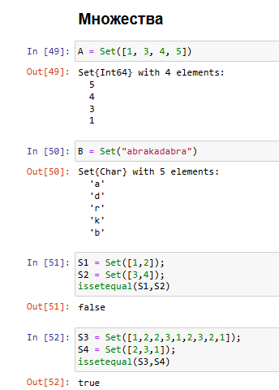{#fig-004 width=20%}

## Примеры

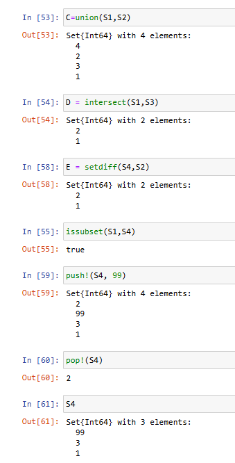{#fig-005 width=20%}

## Примеры

{#fig-006 width=25%}

## Примеры

{#fig-007 width=30%}

## Примеры

{#fig-008 width=20%}

## Примеры

{#fig-009 width=30%}

## Примеры

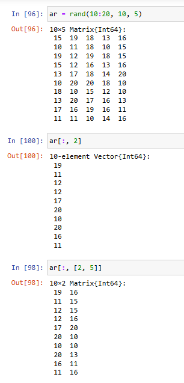{#fig-010 width=20%}

## Примеры

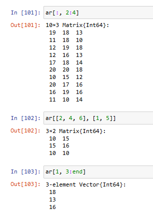{#fig-011 width=20%}

## Примеры

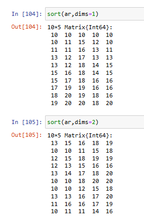{#fig-012 width=20%}

## Примеры

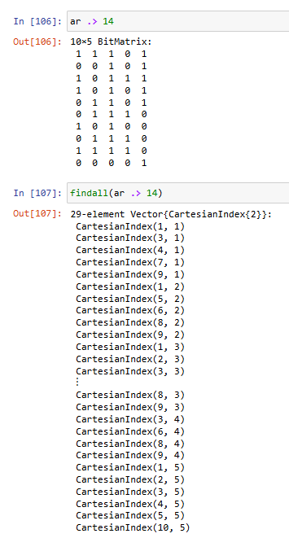{#fig-013 width=15%}

## Задание №2

Далее, необходимо было выполнить *Задания для самостоятельного выполнения*

## Задачи для самостоятельного выполнения

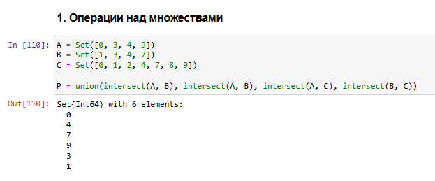{#fig-014 width=45%}

## Задачи для самостоятельного выполнения

{#fig-015 width=15%}

## Задачи для самостоятельного выполнения

{#fig-016 width=25%}

## Задачи для самостоятельного выполнения

{#fig-017 width=40%}

## Задачи для самостоятельного выполнения

{#fig-018 width=25%}

## Задачи для самостоятельного выполнения

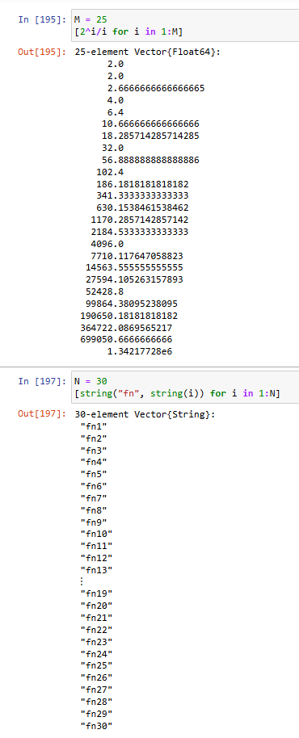{#fig-019 width=20%}

## Задачи для самостоятельного выполнения

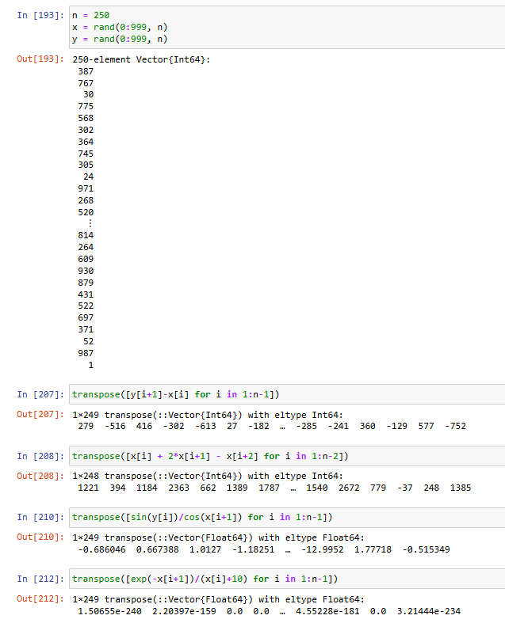{#fig-020 width=25%}

## Задачи для самостоятельного выполнения

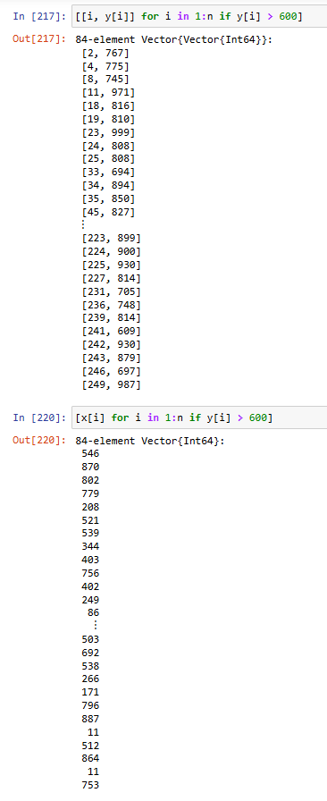{#fig-021 width=15%}

## Задачи для самостоятельного выполнения

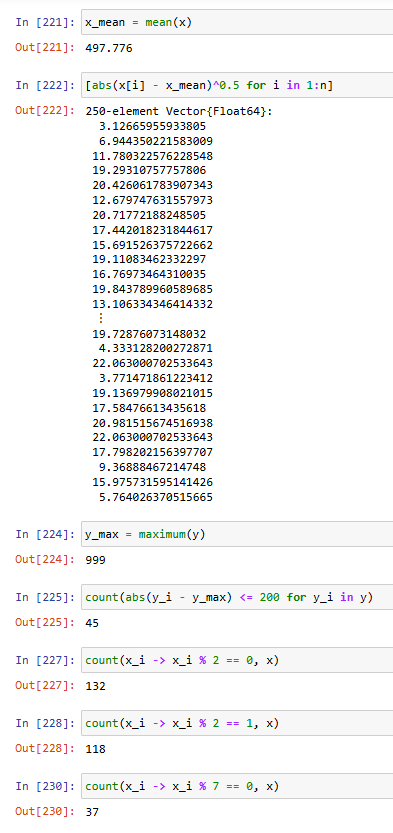{#fig-022 width=15%}

## Задачи для самостоятельного выполнения

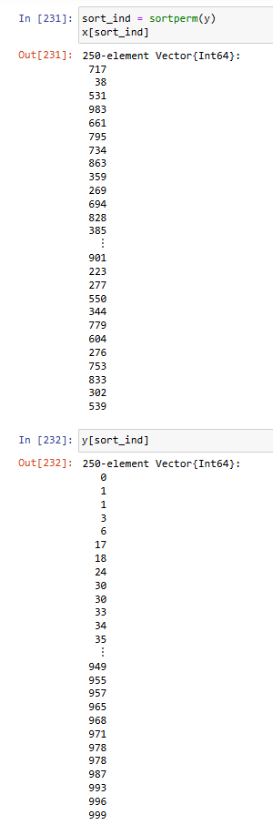{#fig-023 width=15%}

## Задачи для самостоятельного выполнения

{#fig-024 width=15%}

## Задачи для самостоятельного выполнения

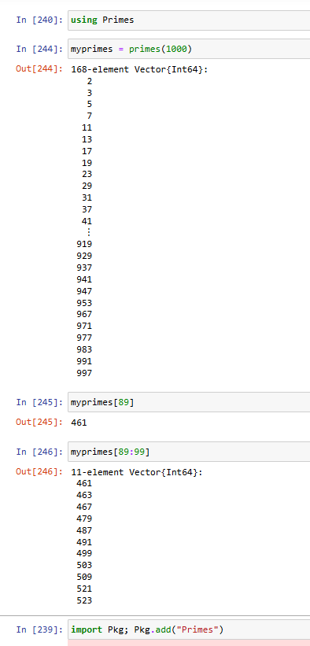{#fig-025 width=15%}

## Задачи для самостоятельного выполнения

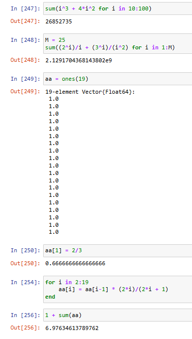{#fig-026 width=15%}

# Выводы

## Выводы

В ходе работы были изучены основы работы с разными типами структур в я.п. Julia.
