---
## Author
author:
  name: Надежда Александровна Рогожина
  email: 1132222840@rudn.ru
  affiliation:
    - name: Российский университет дружбы народов
      country: Российская Федерация
      postal-code: 117198
      city: Москва
      address: ул. Миклухо-Маклая, д. 6

## Title
title: "Отчёт по лабораторной работе №2"
subtitle: "Компьютерный практикум по статистическому анализу"
license: "CC BY"
---

# Цель работы

Основная цель работы — изучить несколько структур данных, реализованных в Julia,
научиться применять их и операции над ними для решения задач.

# Задание

1. Используя Jupyter Lab, повторите примеры из раздела 2.2.
2. Выполните задания для самостоятельной работы (раздел 2.4).

# Теоретическое введение

Научные вычисления традиционно требуют высочайшей производительности, однако эксперты по доменам в значительной степени перенесены на более медленные динамические языки для ежедневной работы. К счастью, методы современного языка и компилятора позволяют в основном устранить компромисс производительности и обеспечивать достаточно продуктивную среду для прототипирования и достаточно эффективно для развертывания применений, интенсивных производительности. Язык программирования Julia заполняет эту роль: это гибкий динамический язык, подходящий для научных и численных вычислений, с производительностью, сравнимой с традиционными статичными языками.

# Выполнение лабораторной работы
 
Первым заданием было повторить примеры, где были показаны основы работы с кортежами ([рис. @fig-001]), словарями ([рис. @fig-002], [рис. @fig-003]), множествами ([рис. @fig-004], [рис. @fig-005]) и массивами ([рис. @fig-006], [рис. @fig-007], [рис. @fig-008], [рис. @fig-009], [рис. @fig-010], [рис. @fig-011], [рис. @fig-012], [рис. @fig-013]).

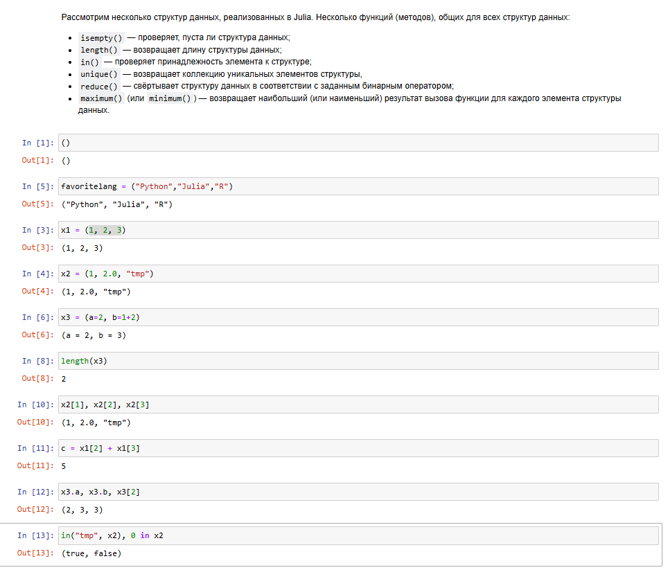{#fig-001 width=45%}

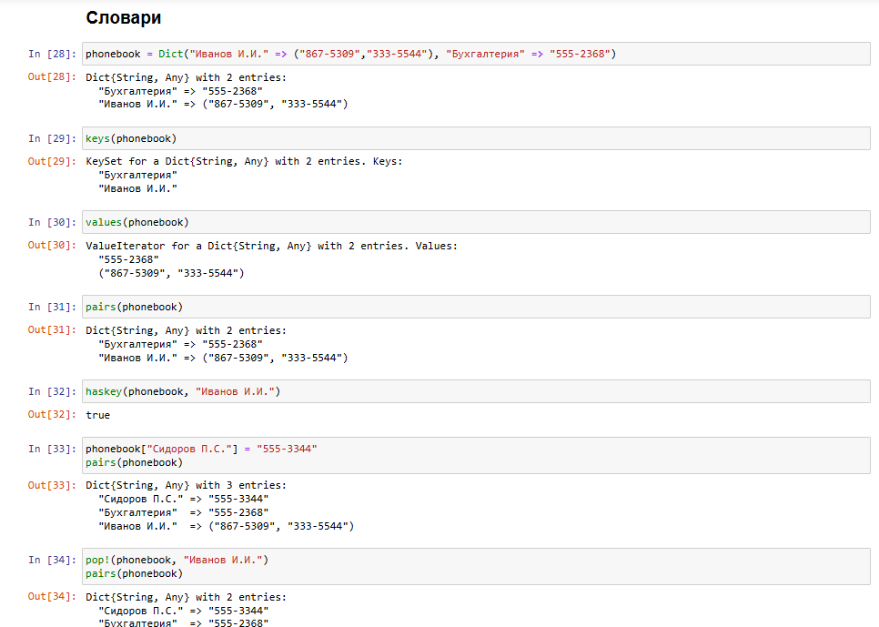{#fig-002 width=45%}

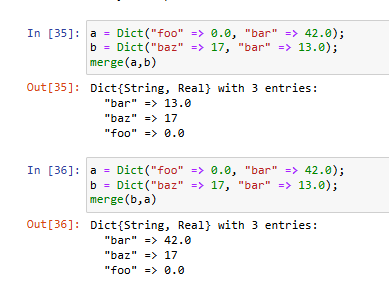{#fig-003 width=70%}

{#fig-004 width=70%}

{#fig-005 width=50%}

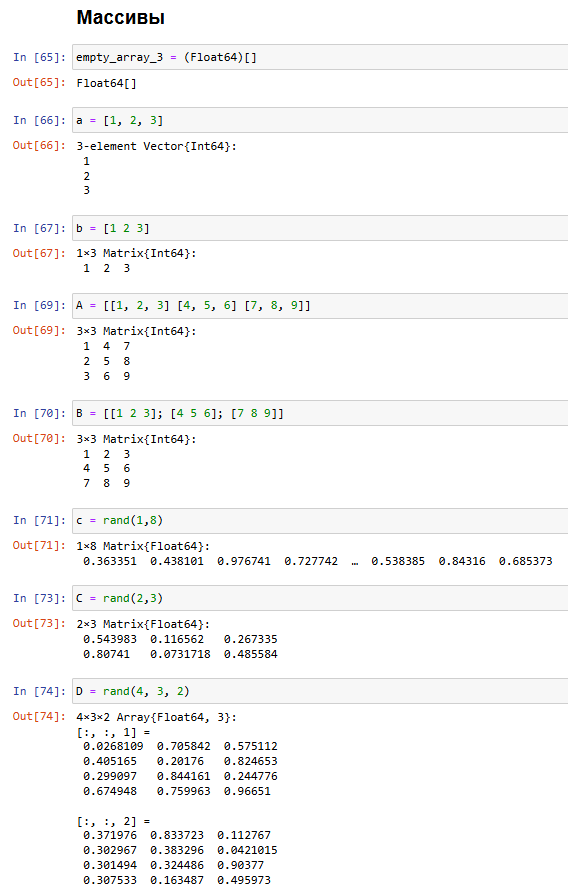{#fig-006 width=50%}

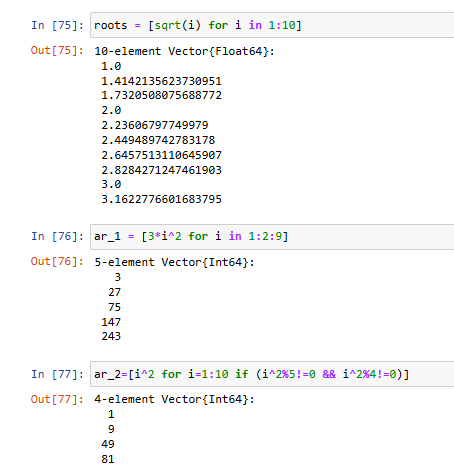{#fig-007 width=70%}

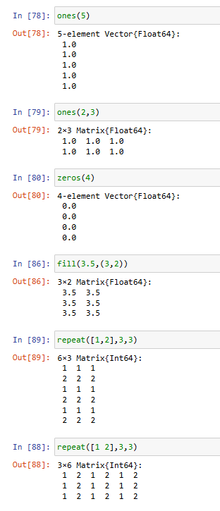{#fig-008 width=45%}

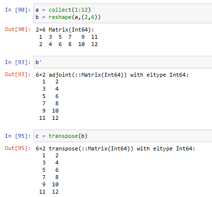{#fig-009 width=70%}

{#fig-010 width=50%}

{#fig-011 width=70%}

{#fig-012 width=70%}

{#fig-013 width=45%}

Далее, необходимо было выполнить *Задания для самостоятельного выполнения*:

1. Даны множества: 
- 𝐴 = {0, 3, 4, 9}, 
- 𝐵 = {1, 3, 4, 7}, 
- 𝐶 = {0, 1, 2, 4, 7, 8, 9}. 

Найти $$𝑃 = 𝐴 ∩ 𝐵 ∪ 𝐴 ∩ 𝐵 ∪ 𝐴 ∩ 𝐶 ∪ 𝐵 ∩ 𝐶 $$ ([рис. @fig-014]).

{#fig-014 width=45%}

2. Приведите свои примеры с выполнением операций над множествами элементов разных типов ([рис. @fig-015]).

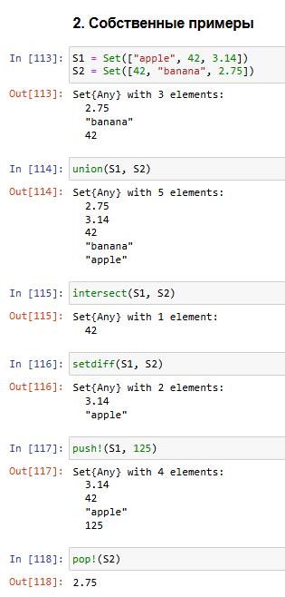{#fig-015 width=45%}

3. Создайте разными способами:

	1) массив $(1, 2, 3, … 𝑁 − 1, 𝑁 ), 𝑁$ выберите больше 20 ([рис. @fig-016]);
	2) массив $(𝑁, 𝑁 − 1 … , 2, 1), 𝑁$ выберите больше 20 ([рис. @fig-016]);
	3) массив $(1, 2, 3, … , 𝑁 − 1, 𝑁, 𝑁 − 1, … , 2, 1), 𝑁$ выберите больше 20 ([рис. @fig-016]);
	4) массив с именем tmp вида (4, 6, 3) ([рис. @fig-016]);
	5) массив, в котором первый элемент массива tmp повторяется 10 раз ([рис. @fig-016]);
	6) массив, в котором все элементы массива tmp повторяются 10 раз ([рис. @fig-016]);
	7) массив, в котором первый элемент массива tmp встречается 11 раз, второй элемент — 10 раз, етий элемент — 10 раз ([рис. @fig-016]);
	8) массив, в котором первый элемент массива tmp встречается 10 раз подряд, второй
элемент — 20 раз подряд, третий элемент — 30 раз подряд ([рис. @fig-016]);
	9) массив из элементов вида $2^{𝑡𝑚𝑝[i]}, 𝑖 = 1, 2, 3$, где элемент $2^𝑡𝑚𝑝[3]$ встречается 4 раза; посчитайте в полученном векторе, сколько раз встречается цифра 6, и выведите это значение на экран ([рис. @fig-016]);
	
	10) вектор значений $𝑦 = 𝑒^{𝑥} cos(𝑥)$ в точках $𝑥 = 3, 3.1, 3.2, … , 6$, найдите среднее значение $𝑦$ ([рис. @fig-017]);

	11) вектор вида $(𝑥^𝑖, 𝑦^𝑗), 𝑥 = 0.1, 𝑖 = 3, 6, 9, … , 36, 𝑦 = 0.2, 𝑗 = 1, 4, 7, … , 34$ ([рис. @fig-018]);

	12) вектор с элементами $\frac{2^𝑖}{𝑖}, 𝑖 = 1, 2, … , 𝑀, 𝑀 = 25$ ([рис. @fig-019]);

	13) вектор вида $(”fn1”, ”fn2”, …, ”fnN”), 𝑁$ = 30 ([рис. @fig-019]);

	14) векторы $𝑥 = (𝑥_1, 𝑥_2, … , 𝑥_𝑛) и 𝑦 = (𝑦_1, 𝑦_2, … , 𝑦_𝑛)$ целочисленного типа длины $𝑛 = 250$ как случайные выборки из совокупности 0, 1, … , 999; на его основе ([рис. @fig-020]):
		- сформируйте вектор $(𝑦_2 − 𝑥_1, … , 𝑦_𝑛 − 𝑥_{𝑛−1})$ ([рис. @fig-020]);
		- сформируйте вектор $(𝑥_1 + 2𝑥_2 − 𝑥_3, 𝑥_2 + 2𝑥_3 − 𝑥_4, … , 𝑥_{𝑛−2} + 2𝑥_{𝑛−1} − 𝑥_𝑛)$ ([рис. @fig-020]);
		- сформируйте вектор $(sin(𝑦_1)/cos(𝑥_2), sin(𝑦_2)/cos(𝑥_3), … , sin(𝑦_{𝑛−1})/cos(𝑥_𝑛))$ ([рис. @fig-020]);
		- вычислите $\sum^{𝑛−1}_{𝑖=1} 𝑒^{−𝑥_{𝑖+1}}/(𝑥_𝑖 + 10)$ ([рис. @fig-020]);
		- выберите элементы вектора 𝑦, значения которых больше 600, и выведите на экран; определите индексы этих элементов ([рис. @fig-021]);
		- определите значения вектора 𝑥, соответствующие значениям вектора 𝑦, значения которых больше 600 (под соответствием понимается расположение на аналогичных индексных позициях) ([рис. @fig-021]);
		- сформируйте вектор $(|𝑥1 − 𝑥|^{1/2}, |𝑥2 − 𝑥|^{1/2}, … , |𝑥𝑛 − 𝑥|^{1/2} )$, где $𝑥$ обозначает среднее значение вектора $𝑥 = (𝑥_1, 𝑥_2, … , 𝑥_𝑛)$ ([рис. @fig-022]);
		- определите, сколько элементов вектора $𝑦$ отстоят от максимального значения не более, чем на 200 ([рис. @fig-022]);
		- определите, сколько чётных и нечётных элементов вектора $𝑥$ ([рис. @fig-022]);
		- определите, сколько элементов вектора $𝑥$ кратны 7 ([рис. @fig-022]);
		- отсортируйте элементы вектора $𝑥$ в порядке возрастания элементов вектора $𝑦$ ([рис. @fig-023]);
		- выведите элементы вектора $𝑥$, которые входят в десятку наибольших (top-10) ([рис. @fig-024]);
		- сформируйте вектор, содержащий только уникальные (неповторяющиеся) элементы вектора $𝑥$ ([рис. @fig-024]).

4. Создайте массив `squares`, в котором будут храниться квадраты всех целых чисел от 1 до 100 ([рис. @fig-024]).

5. Подключите пакет `Primes` (функции для вычисления простых чисел). Сгенерируйте массив `myprimes`, в котором будут храниться первые 168 простых чисел. Определите 89-е наименьшее простое число. Получите срез массива с 89-го до 99-го элемента включительно, содержащий наименьшие простые числа ([рис. @fig-025]).

6. Вычислите следующие выражения:	
	1) $\sum^100_{𝑖=10} (𝑖^3 + 4𝑖^2)$ ([рис. @fig-026]);
	2) $\sum^𝑀_{𝑖=1} (2^𝑖/𝑖 + 3^𝑖/𝑖^2 ), 𝑀 = 25$ ([рис. @fig-026]);
	3) $1 + 2/3 + (2/3 4/5) + (2/3 4/5 6/7) + ⋯ + (2/3 4/5 … 38/39)$ ([рис. @fig-026]);
	

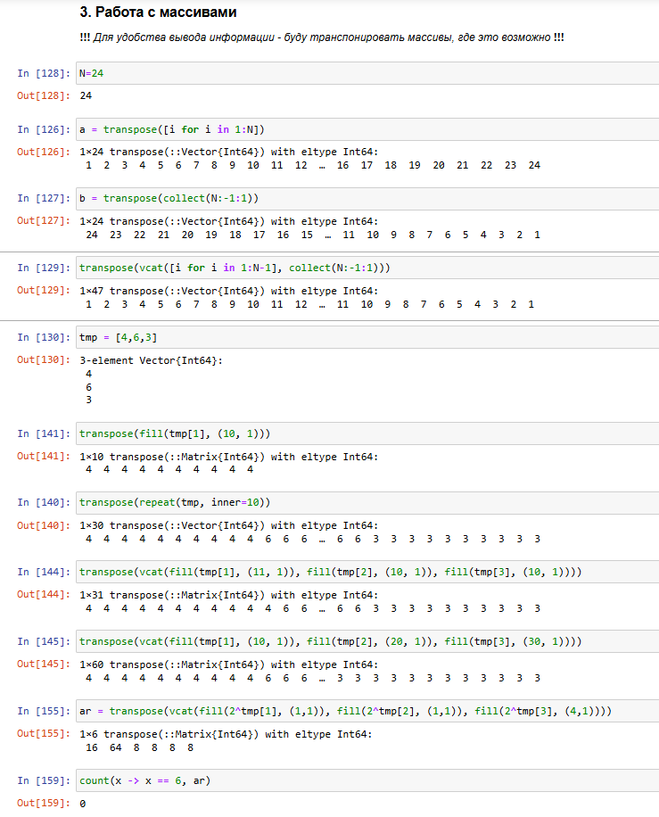{#fig-016 width=45%}

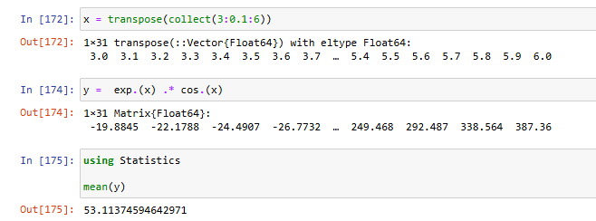{#fig-017 width=45%}

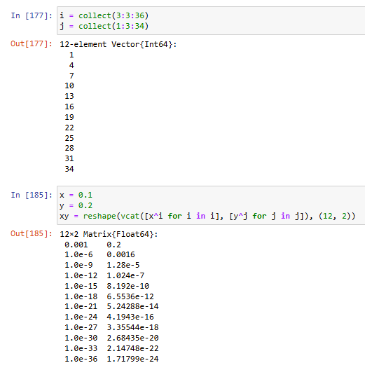{#fig-018 width=45%}

{#fig-019 width=45%}

{#fig-020 width=45%}

{#fig-021 width=45%}

{#fig-022 width=45%}

{#fig-023 width=45%}

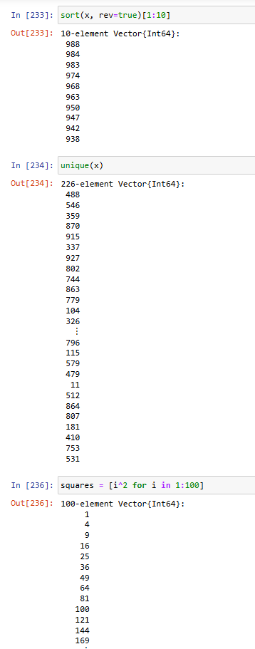{#fig-024 width=45%}

{#fig-025 width=45%}

{#fig-026 width=45%}

# Выводы

В ходе работы были изучены основы работы с разными типами структур в я.п. Julia.

# Список литературы{.unnumbered}

::: {#refs}
:::
