---
## Author
author:
  name: Надежда Александровна Рогожина
  email: 1132222840@rudn.ru
  affiliation:
    - name: Российский университет дружбы народов
      country: Российская Федерация
      postal-code: 117198
      city: Москва
      address: ул. Миклухо-Маклая, д. 6

## Title
title: "Отчёт по лабораторной работе №3"
subtitle: "Компьютерный практикум по статистическому анализу"
license: "CC BY"
---

# Цель работы

Основная цель работы — освоить применение циклов функций и сторонних для Julia
пакетов для решения задач линейной алгебры и работы с матрицами.

# Задание

1. Используя Jupyter Lab, повторите примеры из раздела 3.2.
2. Выполните задания для самостоятельной работы (раздел 3.4).

# Теоретическое введение

Научные вычисления традиционно требуют высочайшей производительности, однако эксперты по доменам в значительной степени перенесены на более медленные динамические языки для ежедневной работы. К счастью, методы современного языка и компилятора позволяют в основном устранить компромисс производительности и обеспечивать достаточно продуктивную среду для прототипирования и достаточно эффективно для развертывания применений, интенсивных производительности. Язык программирования Julia заполняет эту роль: это гибкий динамический язык, подходящий для научных и численных вычислений, с производительностью, сравнимой с традиционными статичными языками.

# Выполнение лабораторной работы
 
Первым заданием было повторить примеры, где были показаны основы работы с циклами ([рис. @fig-001], [рис. @fig-002], [рис. @fig-003], [рис. @fig-004], [рис. @fig-005]), условными выражениями ([рис. @fig-006]), функциями ([рис. @fig-007], [рис. @fig-008], [рис. @fig-009], [рис. @fig-010], [рис. @fig-011], [рис. @fig-012]) и пакетами ([рис. @fig-013]).

{#fig-001 width=50%}

{#fig-002 width=50%}

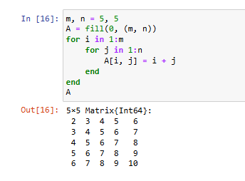{#fig-003 width=50%}

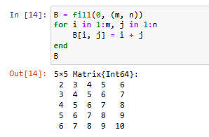{#fig-004 width=50%}

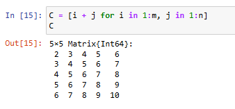{#fig-005 width=50%}

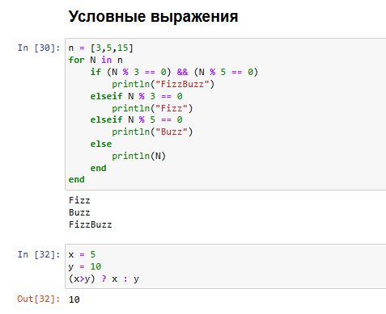{#fig-006 width=50%}

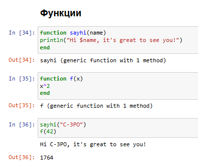{#fig-007 width=50%}

{#fig-008 width=50%}

{#fig-009 width=50%}

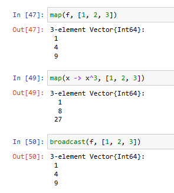{#fig-010 width=50%}

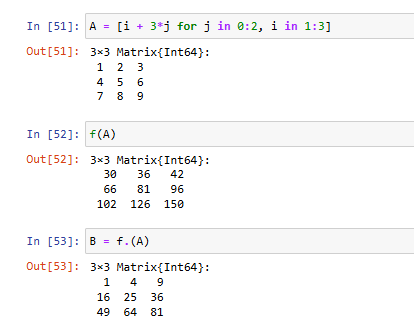{#fig-011 width=50%}

{#fig-012 width=50%}

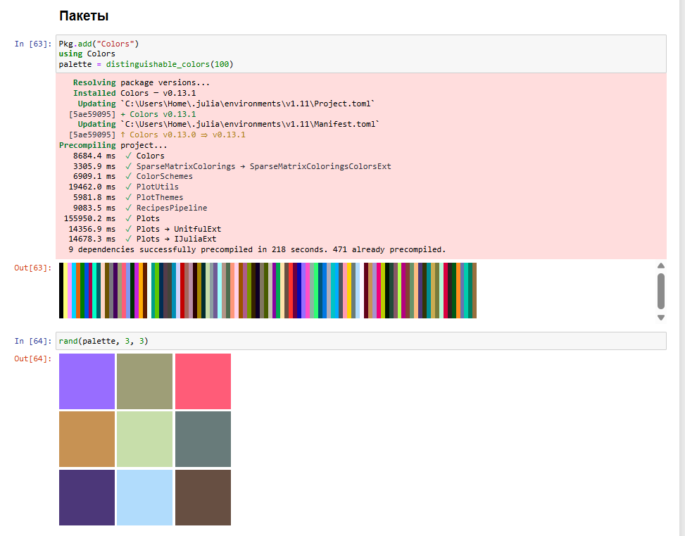{#fig-013 width=50%}

Далее, необходимо было выполнить *Задания для самостоятельного выполнения*:

1. Используя циклы while и for:
– выведите на экран целые числа от 1 до 100 и напечатайте их квадраты ([рис. @fig-014], [рис. @fig-015]);
– создайте словарь squares, который будет содержать целые числа в качестве ключей и квадраты в качестве их пар-значений ([рис. @fig-016], [рис. @fig-017]);
– создайте массив squares_arr, содержащий квадраты всех чисел от 1 до 100 ([рис. @fig-018], [рис. @fig-019]).

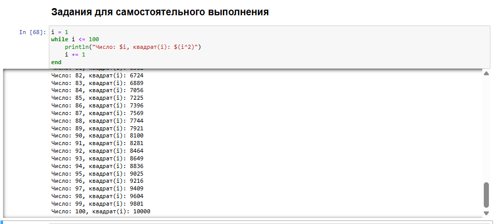{#fig-014 width=50%}

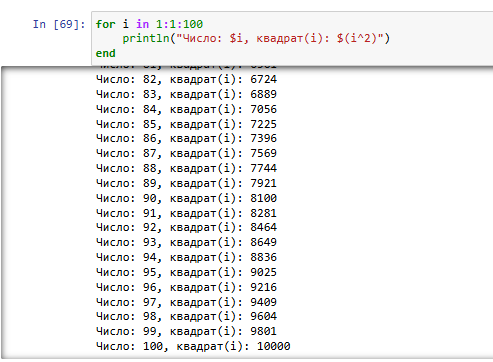{#fig-015 width=50%}

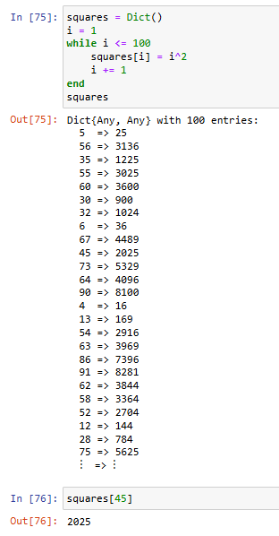{#fig-016 width=50%}

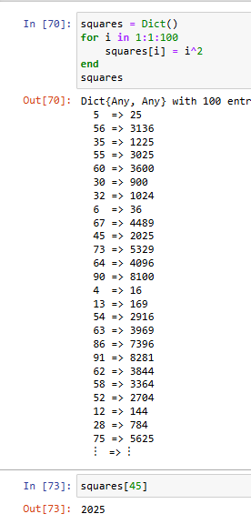{#fig-017 width=50%}

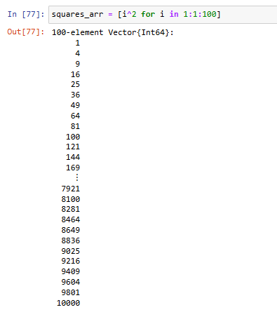{#fig-018 width=50%}

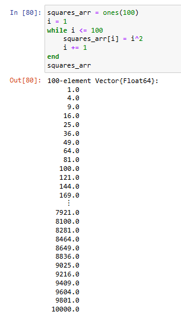{#fig-019 width=50%}

2. Напишите условный оператор, который печатает число, если число чётное, и строку «нечётное», если число нечётное. Перепишите код, используя тернарный оператор ([рис. @fig-020]).

{#fig-020 width=50%}

3. Напишите функцию add_one, которая добавляет 1 к своему входу ([рис. @fig-021]).

{#fig-021 width=50%}

4. Используйте map() или broadcast() для задания матрицы 𝐴, каждый элемент которой увеличивается на единицу по сравнению с предыдущим ([рис. @fig-022]).

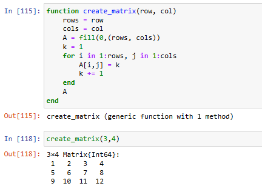{#fig-022 width=50%}

5. Задайте матрицу $A$ ([рис. @fig-023]). 
	1. Найдите $A^3$ ([рис. @fig-023])
	2. Замените третий столбец матрицы $A$ на сумму второго и третьего столбцов ([рис. @fig-024])
	
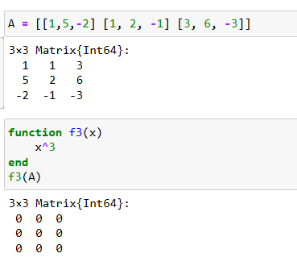{#fig-023 width=50%}

{#fig-024 width=50%}

6. Создайте матрицу $𝐵$ с элементами $𝐵_{𝑖1} = 10, 𝐵_{𝑖2} = −10, 𝐵_{𝑖3} = 10, 𝑖 = 1, 2, … , 15.$ Вычислите матрицу $𝐶 = 𝐵^𝑇 𝐵$ ([рис. @fig-025])

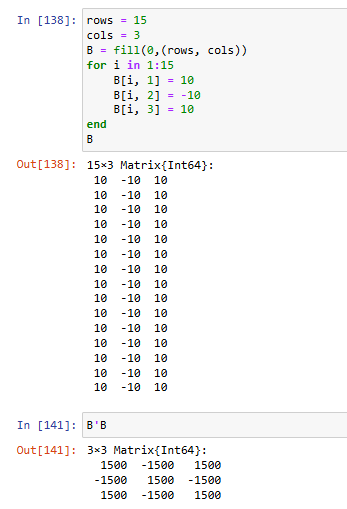{#fig-025 width=50%}
	
7. Создайте матрицу $𝑍$ размерности 6 × 6, все элементы которой равны нулю, и матрицу $𝐸$, все элементы которой равны 1 ([рис. @fig-026]). Используя цикл `while` или `for` и закономерности расположения элементов, создайте следующие матрицы размерности 6 × 6 ([рис. @fig-027], [рис. @fig-028]).
	
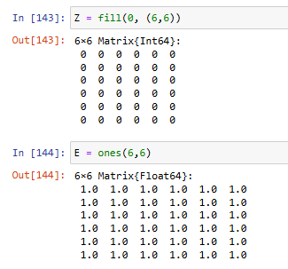{#fig-026 width=50%}

{#fig-027 width=50%}

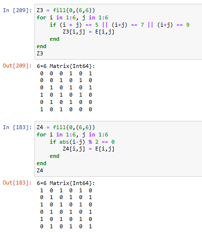{#fig-028 width=50%}
		
8. В языке R есть функция `outer()`. Фактически, это матричное умножение с возможностью изменить применяемую операцию (например, заменить произведение на сложение или возведение в степень).
	1. Напишите свою функцию, аналогичную функции `outer()` языка R. Функция должна иметь следующий интерфейс: outer(x,y,operation). Таким образом, функция вида `outer(A,B,*)` должна быть эквивалентна произведению матриц 𝐴 и 𝐵 размерностями 𝐿 × 𝑀 и 𝑀 × 𝑁 соответственно ([рис. @fig-029]).
	2. Используя написанную вами функцию outer(), создайте матрицы следующей
структуры ([рис. @fig-030], [рис. @fig-031], [рис. @fig-032]).

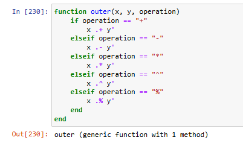{#fig-029 width=50%}

{#fig-030 width=50%}

{#fig-031 width=50%}

{#fig-032 width=50%}

9. Решите следующую систему линейных уравнений с 5 неизвестными ([рис. @fig-033]).

{#fig-033 width=50%}

10. Создайте матрицу $𝑀$ размерности 6 × 10, элементами которой являются целые числа, выбранные случайным образом с повторениями из совокупности 1, 2, … , 10 ([рис. @fig-033]). 
	- Найдите число элементов в каждой строке матрицы $𝑀$, которые больше числа $𝑁$ (например, $𝑁 = 4$) ([рис. @fig-034]).
	- Определите, в каких строках матрицы $𝑀$ число $m$ (например, $m = 7$) встречается ровно 2 раза? ([рис. @fig-035])
	- Определите все пары столбцов матрицы $𝑀$, сумма элементов которых больше $𝐾$ (например, $𝐾 = 75$) ([рис. @fig-036]).
	
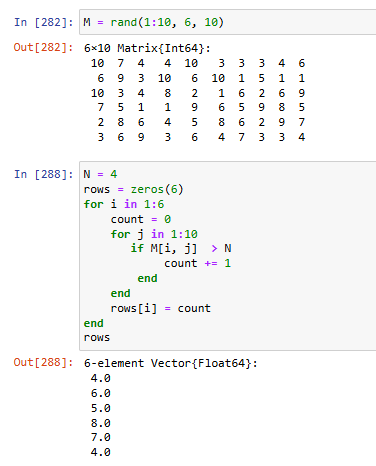{#fig-034 width=50%}

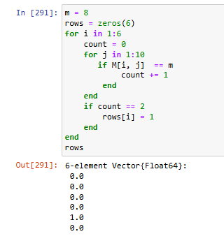{#fig-035 width=50%}

{#fig-036 width=50%}

11.Вычислите 2 суммы ([рис. @fig-037]).

{#fig-037 width=50%}

# Выводы

В ходе работы были изучены основы работы с функциями и циклами в я.п. Julia.

# Список литературы{.unnumbered}

::: {#refs}
:::
