---
## Author
author:
  name: Надежда Александровна Рогожина
  email: 1132222840@rudn.ru
  affiliation:
    - name: Российский университет дружбы народов
      country: Российская Федерация
      postal-code: 117198
      city: Москва
      address: ул. Миклухо-Маклая, д. 6
## Title
title: Лабораторная работа №4
subtitle: Компьютерный практикум по статистическому анализу
license: CC BY
date: today
date-format: "YYYY-MM-DD" # Example: 2025-10-21
---

# Информация

## Докладчик

:::::::::::::: {.columns align=center}
::: {.column width="70%"}

  * Рогожина Надежда Александровна
  * студентка 4 курса НФИбд-02-22
  * Российский университет дружбы народов им. П. Лумумбы
  * [1132222840@rudn.ru](mailto:1132222840@rudn.ru)
  * <https://MikoGreen.github.io/ru/>

:::
::: {.column width="30%"}

:::
::::::::::::::

# Введение

## Цель работы

Основной целью работы является изучение возможностей специализированных пакетов Julia для выполнения и оценки эффективности операций над объектами линейной алгебры.

## Задание

1. Используя Jupyter Lab, повторите примеры из раздела 4.2.
2. Выполните задания для самостоятельной работы (раздел 4.4).

## Теоретическое введение

Научные вычисления традиционно требуют высочайшей производительности, однако эксперты по доменам в значительной степени перенесены на более медленные динамические языки для ежедневной работы. К счастью, методы современного языка и компилятора позволяют в основном устранить компромисс производительности и обеспечивать достаточно продуктивную среду для прототипирования и достаточно эффективно для развертывания применений, интенсивных производительности. Язык программирования Julia заполняет эту роль: это гибкий динамический язык, подходящий для научных и численных вычислений, с производительностью, сравнимой с традиционными статичными языками.

# Выполнение лабораторной работы

## Примеры

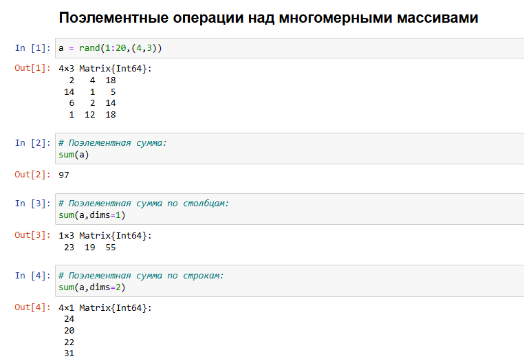{#fig-001 width=50%}

## Примеры

{#fig-002 width=50%}

## Примеры

{#fig-003 width=50%}

## Примеры

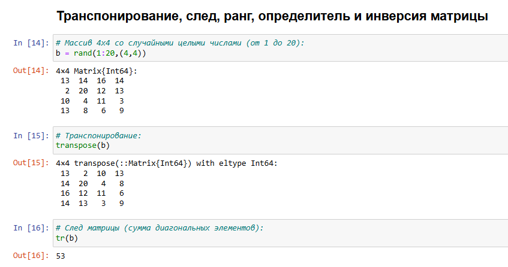{#fig-004 width=50%}

## Примеры

{#fig-005 width=50%}

## Примеры

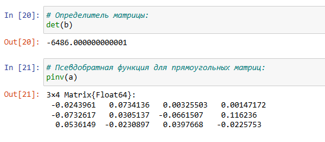{#fig-006 width=50%}

## Примеры

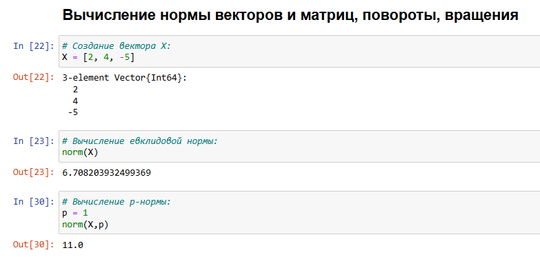{#fig-007 width=50%}

## Примеры

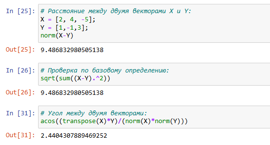{#fig-008 width=50%}

## Примеры

{#fig-009 width=50%}

## Примеры

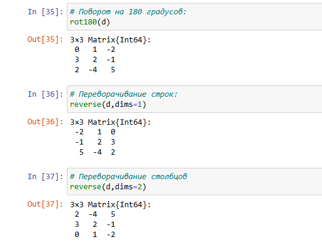{#fig-010 width=50%}

## Примеры

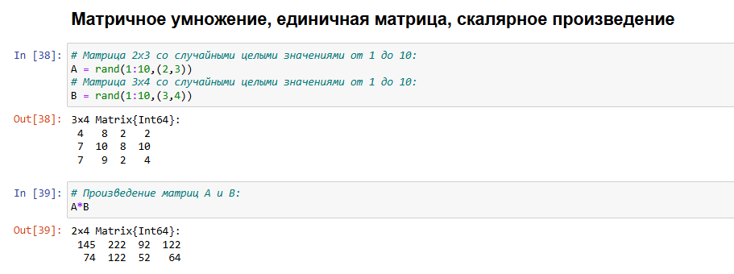{#fig-011 width=50%}

## Примеры

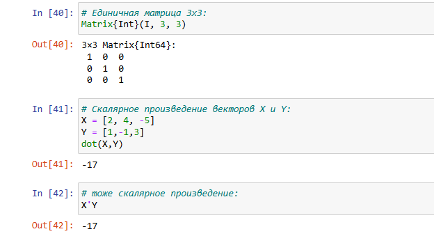{#fig-012 width=50%}

## Примеры

{#fig-013 width=50%}

## Примеры

{#fig-014 width=50%}

## Примеры

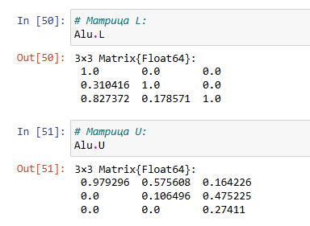{#fig-015 width=50%}

## Примеры

{#fig-016 width=50%}

## Примеры

{#fig-017 width=50%}

## Примеры

{#fig-018 width=50%}

## Примеры

{#fig-019 width=50%}

## Примеры

{#fig-020 width=50%}

## Примеры

{#fig-021 width=50%}

## Примеры

{#fig-022 width=50%}

## Примеры

{#fig-023 width=50%}

## Примеры

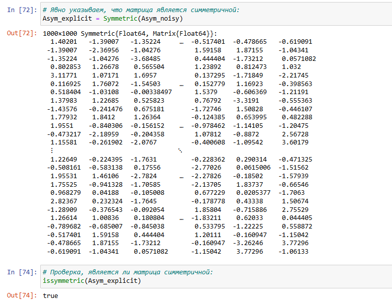{#fig-024 width=50%}

## Примеры

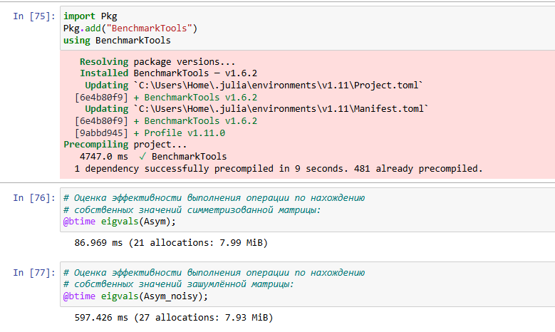{#fig-025 width=50%}

## Примеры

{#fig-026 width=50%}

## Примеры

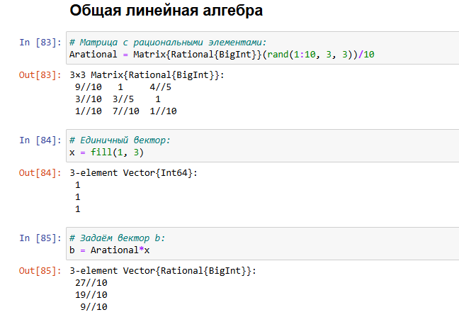{#fig-027 width=50%}

## Примеры

{#fig-028 width=50%}

## Задачи для самостоятельного выполнения

Далее, необходимо было выполнить *Задания для самостоятельного выполнения*:

## Произведение векторов

{#fig-029 width=50%}

## Системы линейных уравнений

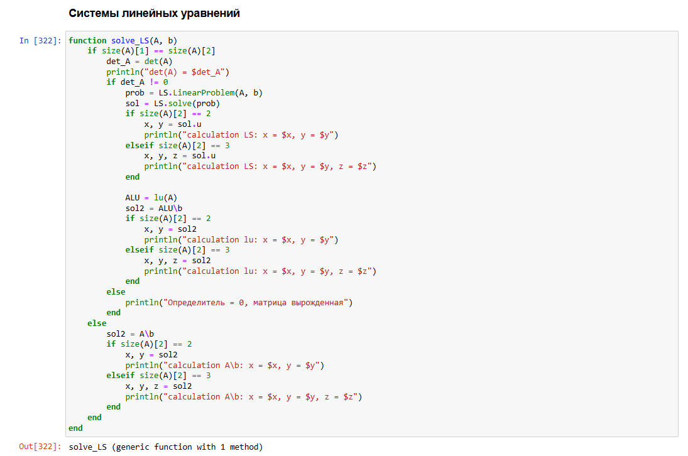{#fig-030 width=50%}

## Системы линейных уравнений

{#fig-031 width=50%}

## Системы линейных уравнений

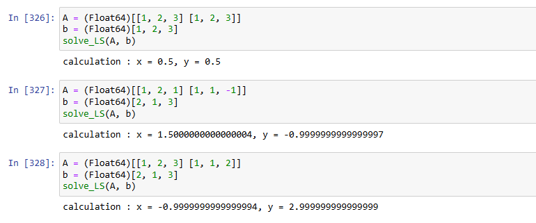{#fig-032 width=50%}

## Системы линейных уравнений

{#fig-033 width=50%}

## Операции с матрицами

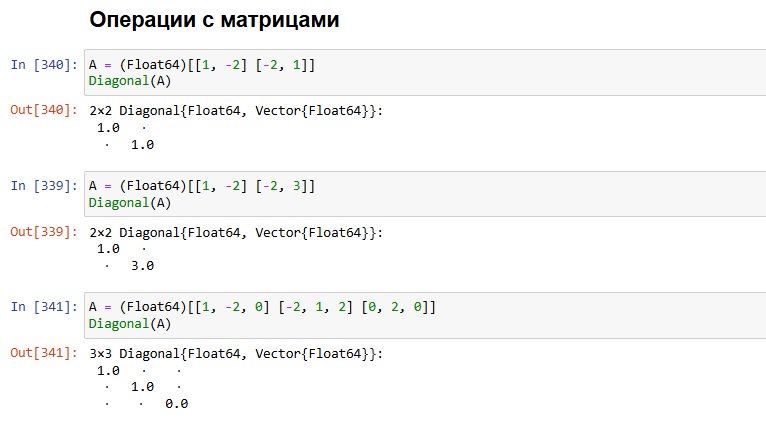{#fig-034 width=50%}

## Операции с матрицами

{#fig-035 width=50%}

## Операции с матрицами

{#fig-036 width=50%}

## Операции с матрицами

{#fig-037 width=50%}

## Линейные модели экономики

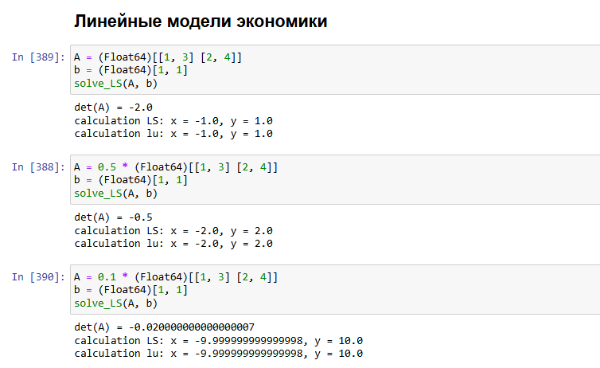{#fig-038 width=50%}

## Линейные модели экономики

{#fig-039 width=50%}

## Линейные модели экономики

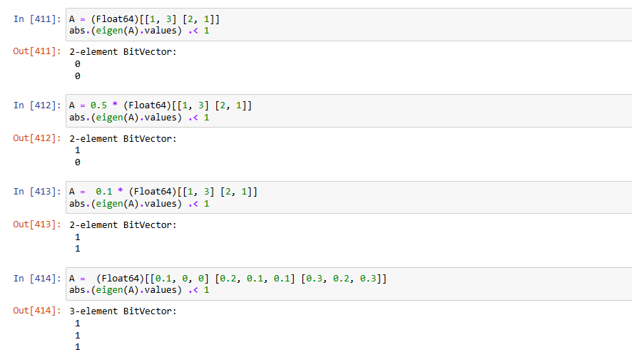{#fig-040 width=50%}

# Выводы

## Выводы

В ходе работы были изучены основные способы решения задач линейной алгебры в я.п. Julia.
