---
## Author
author:
  name: Надежда Александровна Рогожина
  email: 1132222840@rudn.ru
  affiliation:
    - name: Российский университет дружбы народов
      country: Российская Федерация
      postal-code: 117198
      city: Москва
      address: ул. Миклухо-Маклая, д. 6

## Title
title: "Отчёт по лабораторной работе №4"
subtitle: "Компьютерный практикум по статистическому анализу"
license: "CC BY"
---

# Цель работы

Основной целью работы является изучение возможностей специализированных пакетов Julia для выполнения и оценки эффективности операций над объектами линейной алгебры.

# Задание

1. Используя Jupyter Lab, повторите примеры из раздела 4.2.
2. Выполните задания для самостоятельной работы (раздел 4.4).

# Теоретическое введение

Научные вычисления традиционно требуют высочайшей производительности, однако эксперты по доменам в значительной степени перенесены на более медленные динамические языки для ежедневной работы. К счастью, методы современного языка и компилятора позволяют в основном устранить компромисс производительности и обеспечивать достаточно продуктивную среду для прототипирования и достаточно эффективно для развертывания применений, интенсивных производительности. Язык программирования Julia заполняет эту роль: это гибкий динамический язык, подходящий для научных и численных вычислений, с производительностью, сравнимой с традиционными статичными языками.

# Выполнение лабораторной работы

## Примеры

Первым заданием было повторить примеры, где были показаны поэлементные операции над многомерными массивами ([рис. @fig-001], [рис. @fig-002], [рис. @fig-003]), транспонирование, след, ранг, определитель и инверсия матрицы ([рис. @fig-004], [рис. @fig-005], [рис. @fig-006]), вычисление нормы векторов и матриц, повороты, вращения ([рис. @fig-007], [рис. @fig-008], [рис. @fig-009], [рис. @fig-010]), матричное умножение, единичная матрица, скалярное произведение ([рис. @fig-011], [рис. @fig-012]), факторизация ([рис. @fig-013], [рис. @fig-014], [рис. @fig-015], [рис. @fig-016], [рис. @fig-017], [рис. @fig-018], [рис. @fig-019], [рис. @fig-020], [рис. @fig-021], [рис. @fig-022], [рис. @fig-023], [рис. @fig-024], [рис. @fig-025], [рис. @fig-026]) и общая линейная алгерба ([рис. @fig-027], [рис. @fig-028]).

{#fig-001 width=50%}

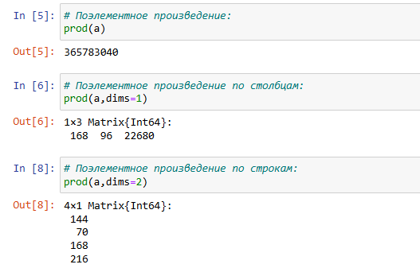{#fig-002 width=50%}

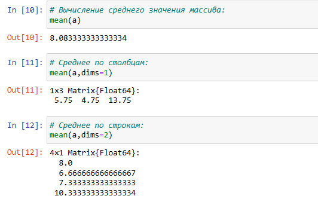{#fig-003 width=50%}

{#fig-004 width=50%}

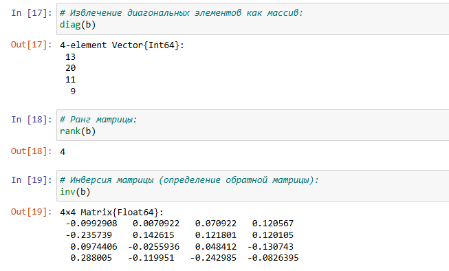{#fig-005 width=50%}

{#fig-006 width=50%}

{#fig-007 width=50%}

{#fig-008 width=50%}

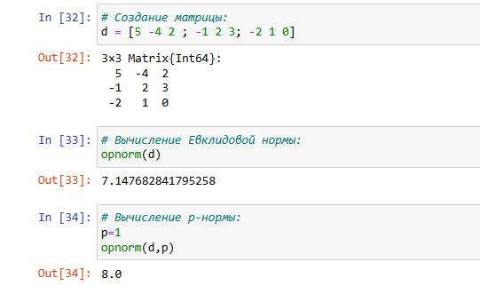{#fig-009 width=50%}

{#fig-010 width=50%}

{#fig-011 width=50%}

{#fig-012 width=50%}

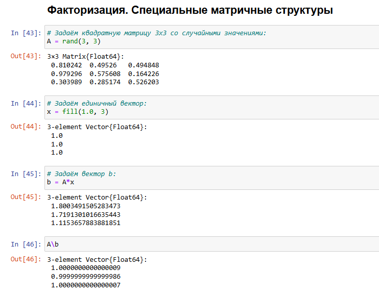{#fig-013 width=50%}

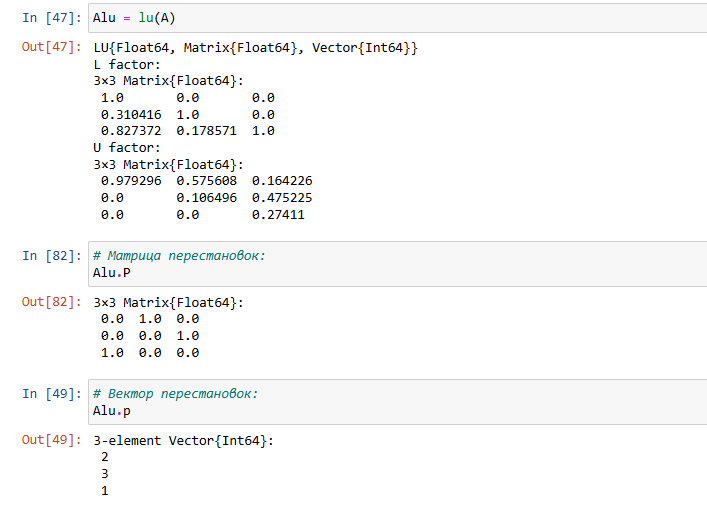{#fig-014 width=50%}

{#fig-015 width=50%}

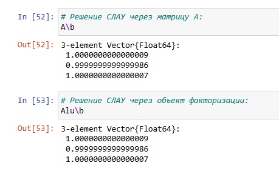{#fig-016 width=50%}

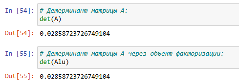{#fig-017 width=50%}

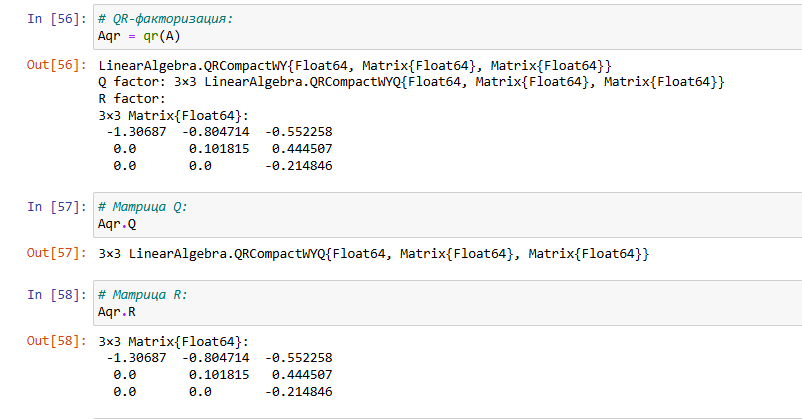{#fig-018 width=50%}

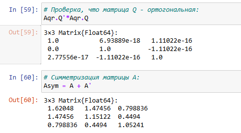{#fig-019 width=50%}

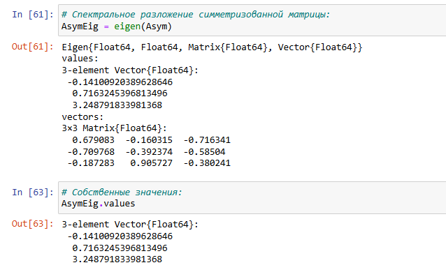{#fig-020 width=50%}

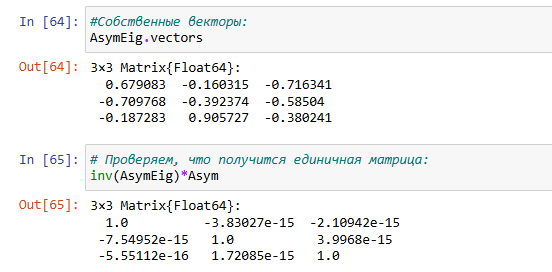{#fig-021 width=50%}

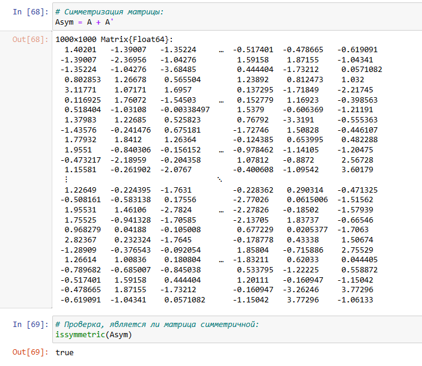{#fig-022 width=50%}
	
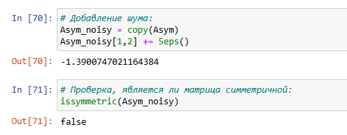{#fig-023 width=50%}

{#fig-024 width=50%}

{#fig-025 width=50%}
	
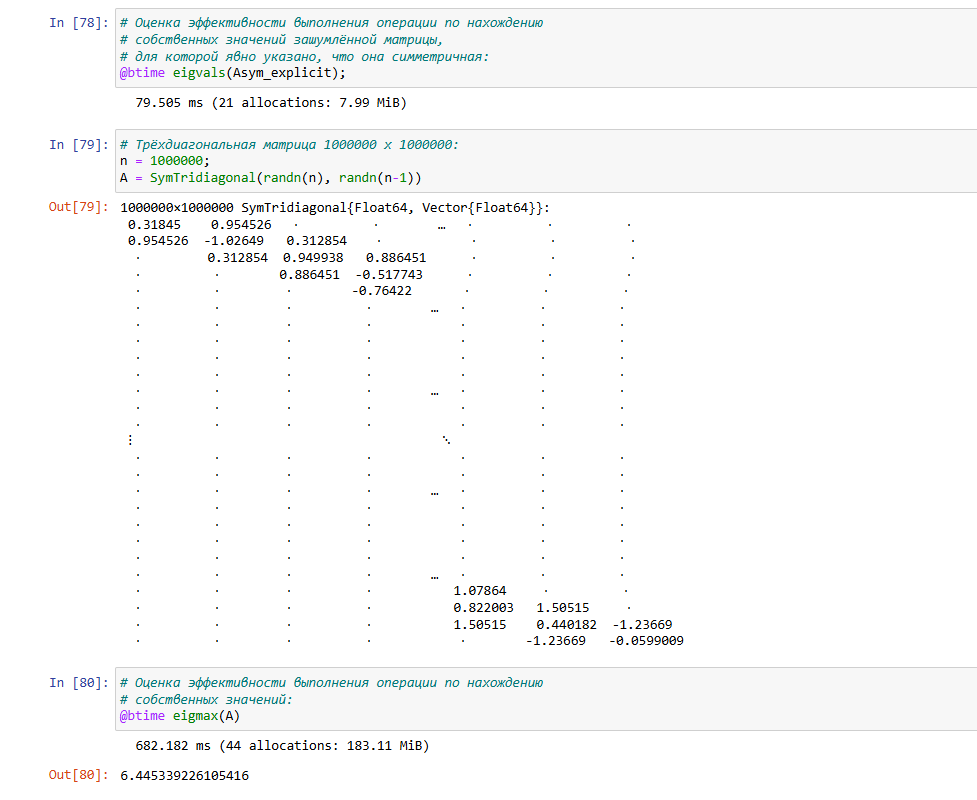{#fig-026 width=50%}

{#fig-027 width=50%}

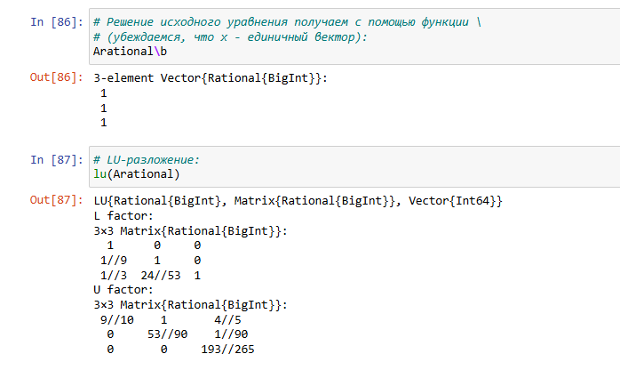{#fig-028 width=50%}
		
## Задания для самостоятельного выполнения

Вторая часть задания - выполнить задания для самостоятельного выполнения.

### Произведение векторов

1. Задайте вектор v. Умножьте вектор v скалярно сам на себя и сохраните результат в dot_v ([рис. @fig-029]).
2. Умножьте v матрично на себя (внешнее произведение), присвоив результат переменной outer_v ([рис. @fig-029]).

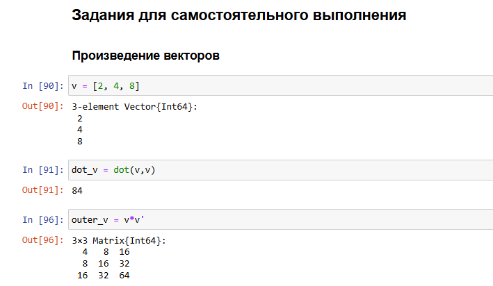{#fig-029 width=50%}

### Системы линейных уравнений

1. Решить СЛАУ с двумя неизвестными ([рис. @fig-030], [рис. @fig-031], [рис. @fig-032]):

{#fig-030 width=50%}

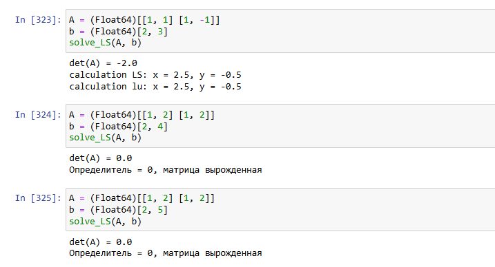{#fig-031 width=50%}

{#fig-032 width=50%}

2. Решить СЛАУ с тремя неизвестными ([рис. @fig-033]).

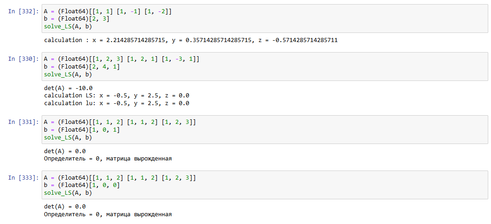{#fig-033 width=50%}

### Операции с матрицами

1. Приведите приведённые ниже матрицы к диагональному виду ([рис. @fig-034]). 

{#fig-034 width=50%}

2. Вычислить ([рис. @fig-035], [рис. @fig-036]):

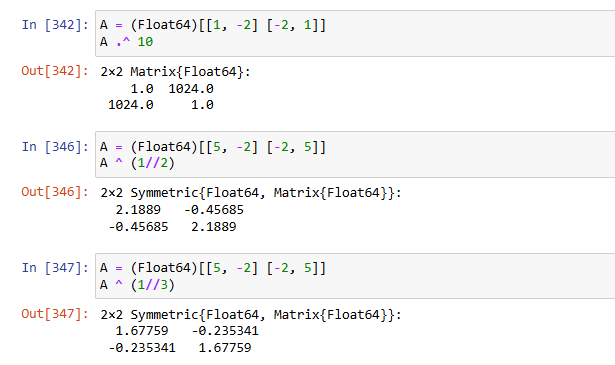{#fig-035 width=50%}

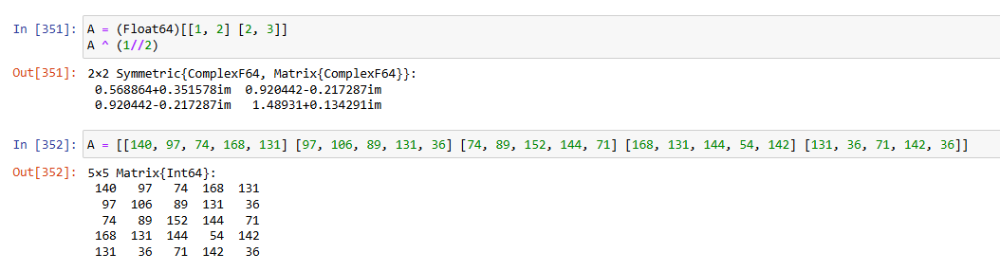{#fig-036 width=50%}

3. Создайте диагональную матрицу из собственных значений матрицы $A$. Создайте нижнедиагональную матрицу из матрица 𝐴. Оцените эффективность выполняемых операций. ([рис. @fig-037]).

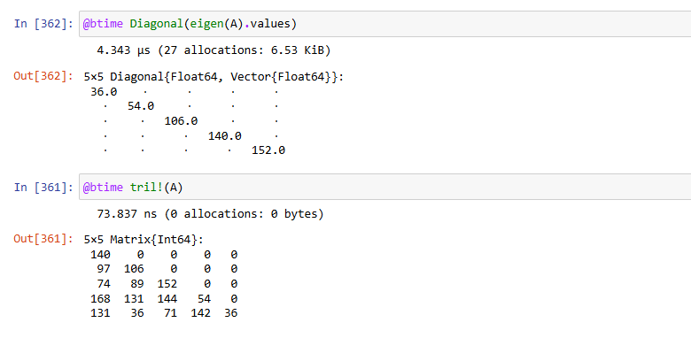{#fig-037 width=50%}

### Линейные модели экономики

1. Матрица $A$ называется продуктивной, если решение $x$ системы при любой неотрицательной правой части $y$ имеет только неотрицательные элементы $x_i$. Используя это определение, проверьте, являются ли матрицы продуктивными ([рис. @fig-038]).

{#fig-038 width=50%}

2. Критерий продуктивности: матрица 𝐴 является продуктивной тогда и только тогда, когда все элементы матрица $$(E − A)^{-1}$$ являются неотрицательными числами. Используя этот критерий, проверьте, являются ли матрицы продуктивными ([рис. @fig-039]).

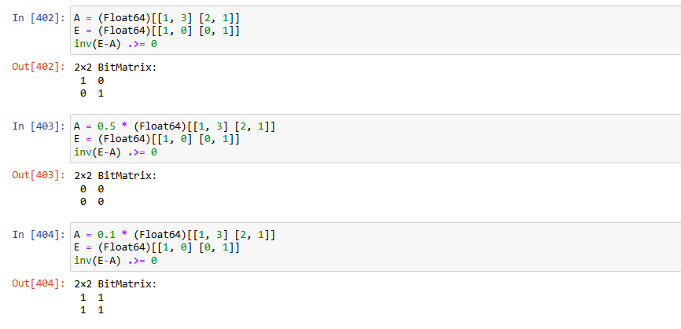{#fig-039 width=50%}

3. Спектральный критерий продуктивности: матрица $A$ является продуктивной тогда и только тогда, когда все её собственные значения по модулю меньше 1. Используя этот критерий, проверьте, являются ли матрицы продуктивными ([рис. @fig-040]).

{#fig-040 width=50%}

# Выводы

В ходе работы были изучены возможности пакетов Julia дял выполнения и оценки эффективности операций в задачах по линейной алгебре.

# Список литературы{.unnumbered}

::: {#refs}
:::