---
## Author
author:
  name: Надежда Александровна Рогожина
  email: 1132222840@rudn.ru
  affiliation:
    - name: Российский университет дружбы народов
      country: Российская Федерация
      postal-code: 117198
      city: Москва
      address: ул. Миклухо-Маклая, д. 6

## Title
title: "Отчёт по лабораторной работе №6"
subtitle: "Компьютерный практикум по статистическому анализу"
license: "CC BY"
---

# Цель работы

Основной целью работы является освоение специализированных пакетов для решения задач в непрерывном и дискретном времени.

# Задание

1. Используя Jupyter Lab, повторите примеры из раздела 6.2.
2. Выполните задания для самостоятельной работы (раздел 6.4).

# Теоретическое введение

Научные вычисления традиционно требуют высочайшей производительности, однако эксперты по доменам в значительной степени перенесены на более медленные динамические языки для ежедневной работы. К счастью, методы современного языка и компилятора позволяют в основном устранить компромисс производительности и обеспечивать достаточно продуктивную среду для прототипирования и достаточно эффективно для развертывания применений, интенсивных производительности. Язык программирования Julia заполняет эту роль: это гибкий динамический язык, подходящий для научных и численных вычислений, с производительностью, сравнимой с традиционными статичными языками.

# Выполнение лабораторной работы

## Примеры

Первым делом импортируем нужные библиотеки ([рис. @fig-001]):

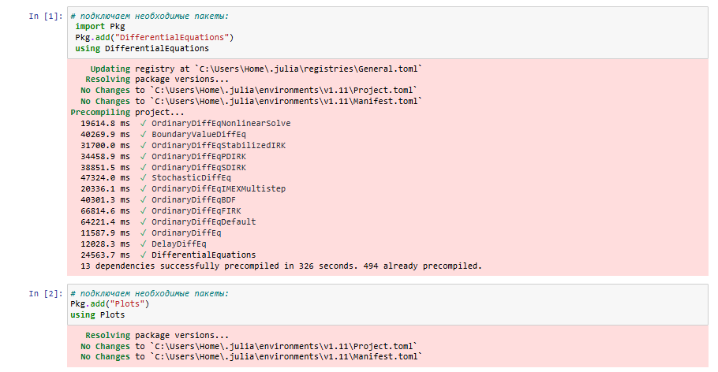{#fig-001 width=65%}

Далее, рассмотрим примеры решение модели экспоненциального роста ([рис. @fig-002], [рис. @fig-003], [рис. @fig-004], [рис. @fig-005]), решение системы Лоренца ([рис. @fig-006], [рис. @fig-007], [рис. @fig-008], [рис. @fig-009]), решение модели Лотки-Вольтерры ([рис. @fig-010], [рис. @fig-011], [рис. @fig-012], [рис. @fig-013]). 

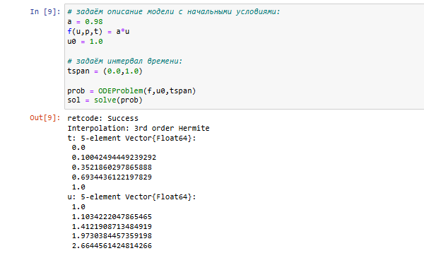{#fig-002 width=65%}

{#fig-003 width=65%}

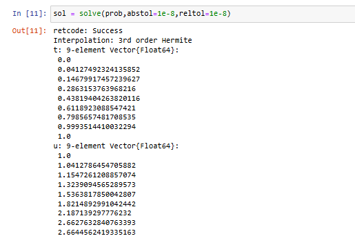{#fig-004 width=65%}

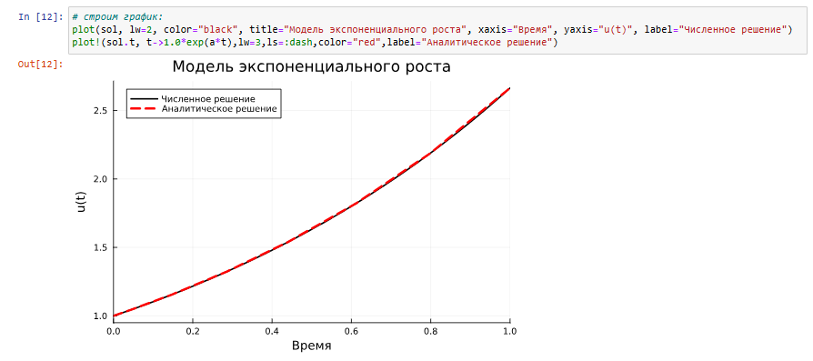{#fig-005 width=65%}

{#fig-006 width=65%}

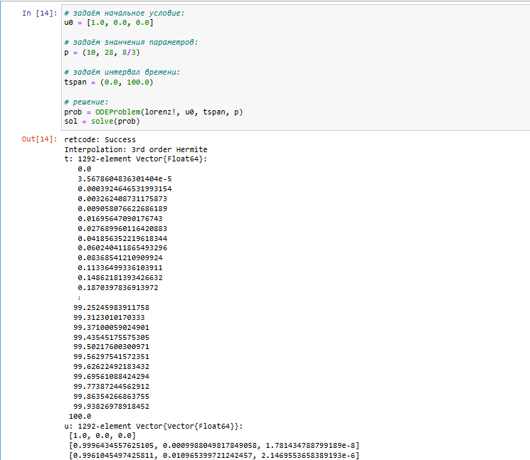{#fig-007 width=65%}

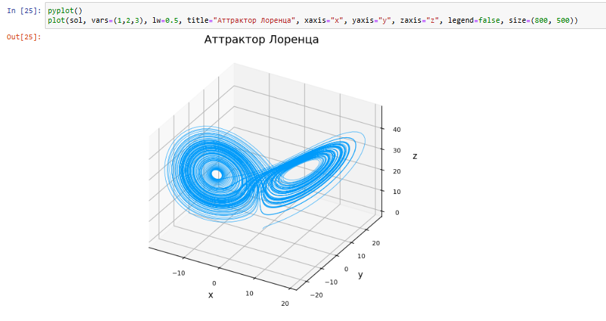{#fig-008 width=65%}

{#fig-009 width=65%}

{#fig-010 width=65%}

{#fig-011 width=65%}

{#fig-012 width=65%}

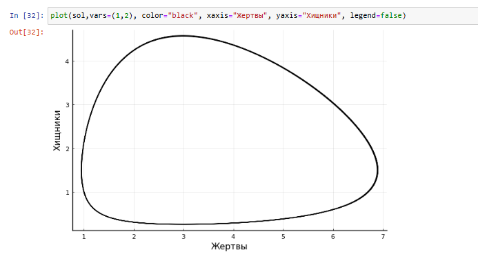{#fig-013 width=65%}

## Задания для самостоятельного выполнения

1. Реализовать и проанализировать модель роста численности изолированной популяции (модель Мальтуса, [рис. @fig-014], [рис. @fig-015], [рис. @fig-016], [рис. @fig-017]):
$$ 
\dot{x} = ax, a = b - c,
$$
где $x(t)$ — численность изолированной популяции в момент времени $t$, $a$ — коэффициент роста популяции, $b$ — коэффициент рождаемости, $c$ — коэффициент смертности.
Начальные данные и параметры задать самостоятельно и пояснить их выбор. Построить соответствующие графики (в том числе с анимацией).

{#fig-014 width=65%}

{#fig-015 width=65%}

{#fig-016 width=65%}

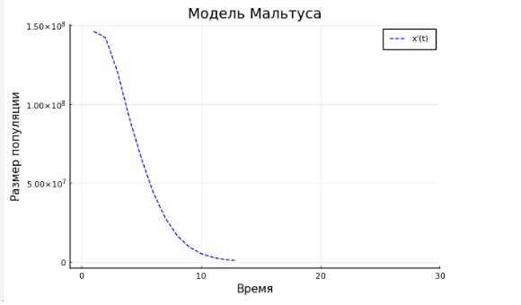{#fig-017 width=65%}

2. Реализовать и проанализировать логистическую модель роста популяции ([рис. @fig-018], [рис. @fig-019]), заданную уравнением:
$$ 
\dot{x} = rx \Bigg(1 - \frac{x}{k} \Bigg), r>0, k>0, 
$$
$r$ — коэффициент роста популяции, $k$  — потенциальная ёмкость экологической системы (предельное значение численности популяции). Начальные данные и параметры задать самостоятельно и пояснить их выбор. Построить соответствующие графики (в том числе с анимацией).

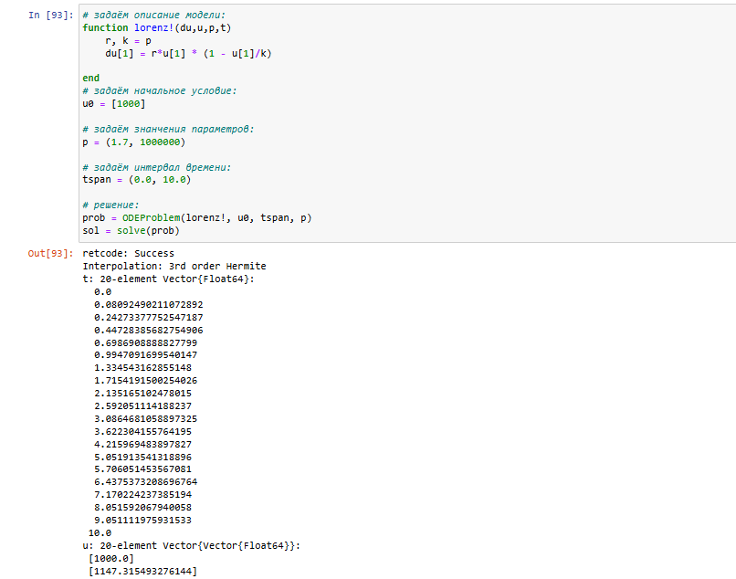{#fig-018 width=65%}

{#fig-019 width=65%}

3. Реализовать и проанализировать модель эпидемии Кермака–Маккендрика (SIR-модель, [рис. @fig-020], [рис. @fig-021]):
$$
  \begin{cases}
    \dot{s} = -\beta i s \\
    \dot{i} = \beta i s - v i \\
    \dot{r} = v i \\
  \end{cases}
$$
где $s(t)$ — численность восприимчивых к болезни индивидов в момент времени $t$, $i(t)$ — численность инфицированных индивидов в момент времени $t$, $r(t)$ — численность переболевших индивидов в момент времени $t$, $\beta$ — коэффициент интенсивности контактов индивидов с последующим инфицированием, $v$ — коэффициент интенсивности выздоровления инфицированных индивидов. Численность популяции считается постоянной, т.е. ̇$\dot{s} + ̇\dot{i} + ̇\dot{r} = 0$. Начальные данные и параметры задать самостоятельно и пояснить их выбор. Построить соответствующие графики (в том числе с анимацией).

{#fig-020 width=65%}

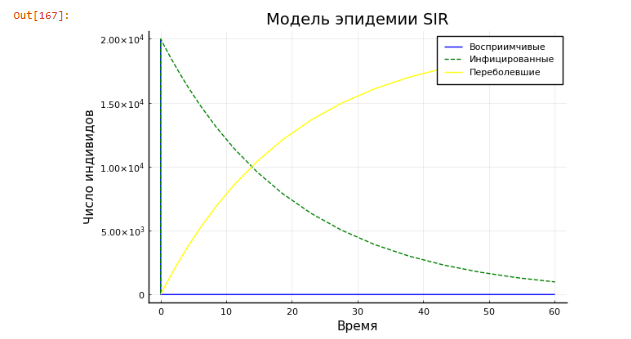{#fig-021 width=65%}

4. Как расширение модели SIR (Susceptible-Infected-Removed) по результатом эпидемии испанки была предложена модель SEIR (Susceptible-Exposed-Infected-Removed, [рис. @fig-022]):
$$
  \begin{cases}
    \dot{s(t)} = \frac{-\beta}{N} i(t) s(t) \\
    \dot{e(t)} = \frac{/beta}{N} i(t) s(t)  - \delta e(t) \\
    \dot{i(t)} = \delta e(t) - \gamma i(t) \\
    \dot{r} = \gamma i(t)
  \end{cases}
$$
Размер популяции сохраняется:
$$
𝑠(𝑡) + 𝑒(𝑡) + 𝑖(𝑡) + 𝑟(𝑡) = 𝑁.
$$
Исследуйте, сравните с SIR.

{#fig-022 width=65%}

5. Для дискретной модели Лотки–Вольтерры ([рис. @fig-023], [рис. @fig-024]):
$$
  \begin{cases}
    X_1(t+1) = a X_1(t)(1-X_1(t)) - X_1(t)X_2(t) \\
    X_2(t+1) = -cX_2(t) + dX_1(t)X_2(t) \\
  \end{cases}
$$
с начальными данными $a$ = 2, $c$ = 1, $d$ = 5 найдите точку равновесия. Получите
и сравните аналитическое и численное решения. Численное решение изобразите на
фазовом портрете.

{#fig-023 width=65%}

{#fig-024 width=65%}

6. Реализовать на языке Julia модель отбора на основе конкурентных отношений ([рис. @fig-025], [рис. @fig-026]):
$$
  \begin{cases}
    \dot{x} = \alpha x - \beta x y \\
    \dot{y} = \alpha y - \beta x y \\
  \end{cases}
$$
Начальные данные и параметры задать самостоятельно и пояснить их выбор. Построить соответствующие графики (в том числе с анимацией) и фазовый портрет.

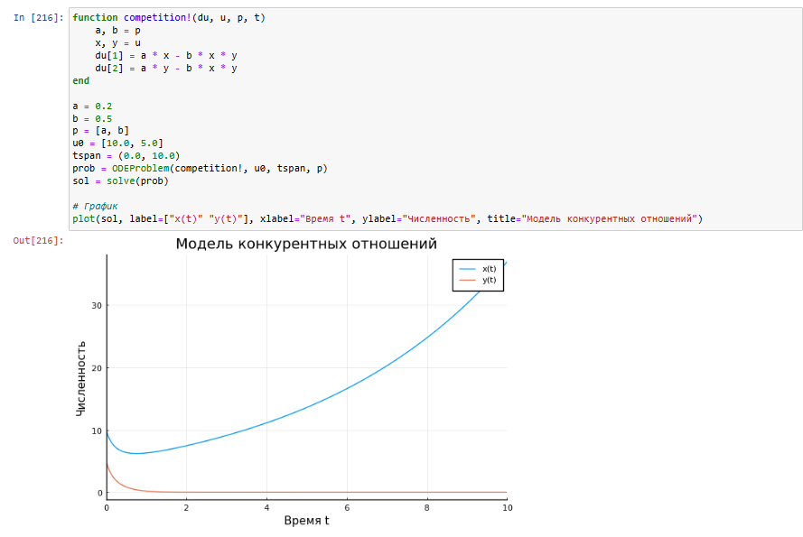{#fig-025 width=65%}
	
{#fig-026 width=65%}

7. Реализовать на языке Julia модель консервативного гармонического осциллятора ([рис. @fig-027], [рис. @fig-028], [рис. @fig-029]):
$$
\ddot{x} + \omega_0^2x=0, x(t_0)=x_0, \dot{x}(t_0) = y_0,
$$
где $\omega_0$ — циклическая частота. Начальные параметры подобрать самостоятельно, выбор пояснить. Построить соответствующие графики (в том числе с анимацией) и фазовый портрет.

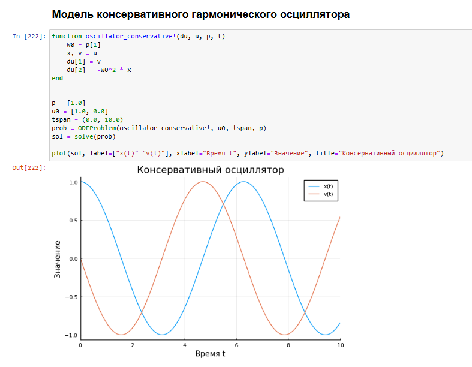{#fig-027 width=65%}

{#fig-028 width=65%}

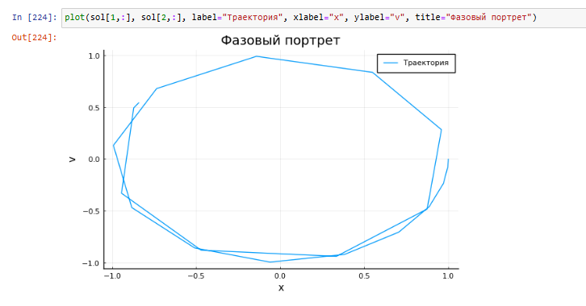{#fig-029 width=65%}

8. Реализовать на языке Julia модель свободных колебаний гармонического осциллятора ([рис. @fig-030], [рис. @fig-031], [рис. @fig-032]):
$$
\ddot{x} + 2\gamma\dot{x} + \omega_0^2x=0, x(t_0)=x_0, \dot{x}(t_0) = y_0,
$$
где $\omega_0$ — циклическая частота, $\gamma$ — параметр, характеризующий потери энергии.
Начальные параметры подобрать самостоятельно, выбор пояснить. Построить соответствующие графики (в том числе с анимацией) и фазовый портрет.

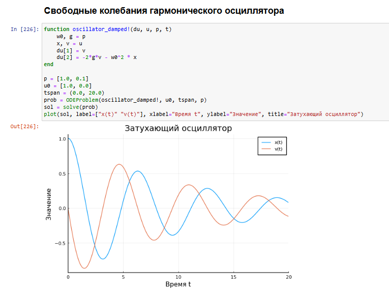{#fig-030 width=65%}

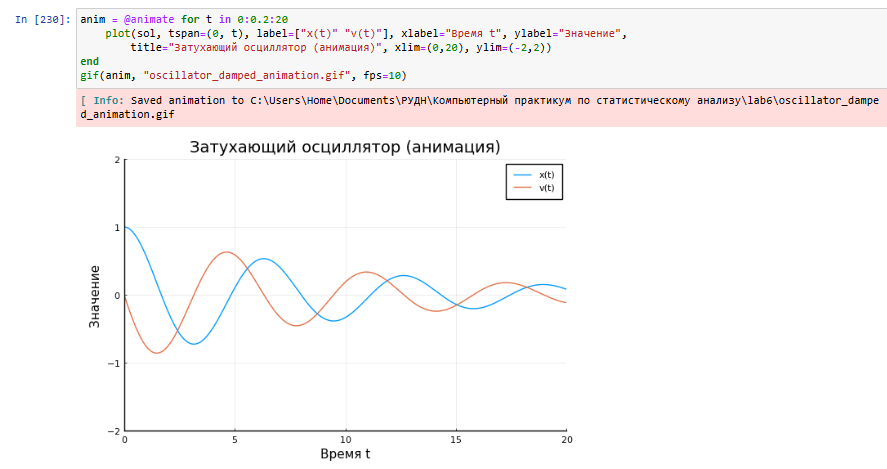{#fig-031 width=65%}

{#fig-032 width=65%}

# Выводы

В ходе работы были изучены возможности Julia в решении дифференциальных уравнений.

# Список литературы{.unnumbered}

::: {#refs}
:::
