---
## Author
author:
  name: Надежда Александровна Рогожина
  email: 1132222840@rudn.ru
  affiliation:
    - name: Российский университет дружбы народов
      country: Российская Федерация
      postal-code: 117198
      city: Москва
      address: ул. Миклухо-Маклая, д. 6

## Title
title: "Отчёт по лабораторной работе №7"
subtitle: "Компьютерный практикум по статистическому анализу"
license: "CC BY"
---

# Цель работы

Основной целью работы является изучение специализированных пакетов Julia для обработки данных.

# Задание

1. Используя Jupyter Lab, повторите примеры из раздела 7.2.
2. Выполните задания для самостоятельной работы (раздел 7.4).

# Теоретическое введение

Обработка и анализ данных, полученных в результате проведения исследований, — важная и неотъемлемая часть исследовательской деятельности. Большое значение имеет выявление определённых связей и закономерностей в имеющихся неструктурированных данных, особенно в данных больших размерностей. Выявленные в данных связей и закономерностей позволяет строить прогнозные модели с предполагаемым результатом. Для решения таких задач применяют методы из таких областей знаний как математическая статистика, программирование, искусственный интеллект, машинное обучение.

# Выполнение лабораторной работы

## Примеры

Первым делом импортируем нужные библиотеки ([рис. @fig-001]):

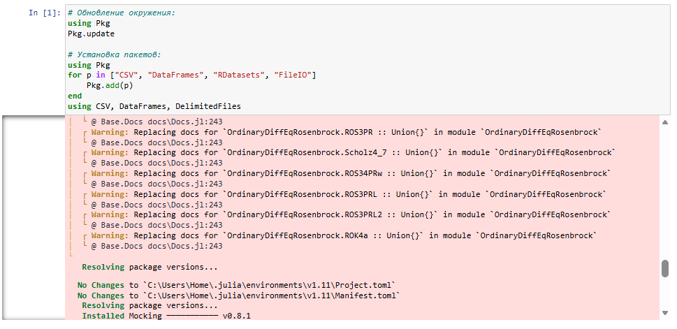{#fig-001 width=65%}

Далее, рассмотрим примеры считывания данных ([рис. @fig-002], [рис. @fig-003], [рис. @fig-004]), записи данных в файл ([рис. @fig-005]), работы со словарями ([рис. @fig-006]), работы с датафреймами ([рис. @fig-007], [рис. @fig-008], [рис. @fig-009], [рис. @fig-010]), работу с переменными отсутствующего типа ([рис. @fig-011], [рис. @fig-012]), работы с изображениями ([рис. @fig-013]), обработки данных ([рис. @fig-014], [рис. @fig-015], [рис. @fig-016], [рис. @fig-017], [рис. @fig-018], [рис. @fig-019], [рис. @fig-020], [рис. @fig-021]), кластеризации данных ([рис. @fig-022], [рис. @fig-023], [рис. @fig-024]), метода главных компонент ([рис. @fig-025], [рис. @fig-026], [рис. @fig-027]) и линейной регрессии ([рис. @fig-028], [рис. @fig-029], [рис. @fig-030], [рис. @fig-031]).

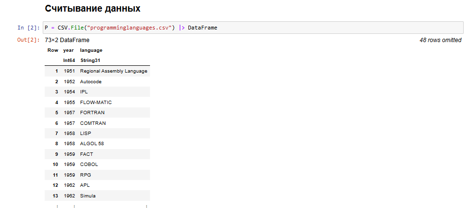{#fig-002 width=65%}

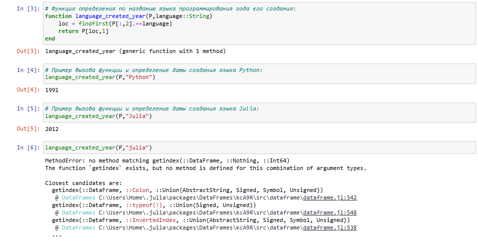{#fig-003 width=65%}

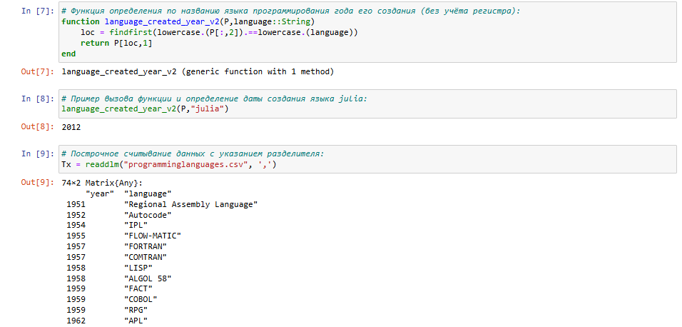{#fig-004 width=65%}

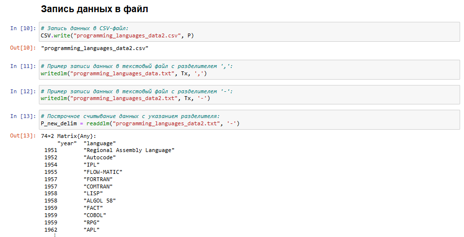{#fig-005 width=65%}

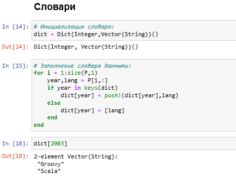{#fig-006 width=65%}

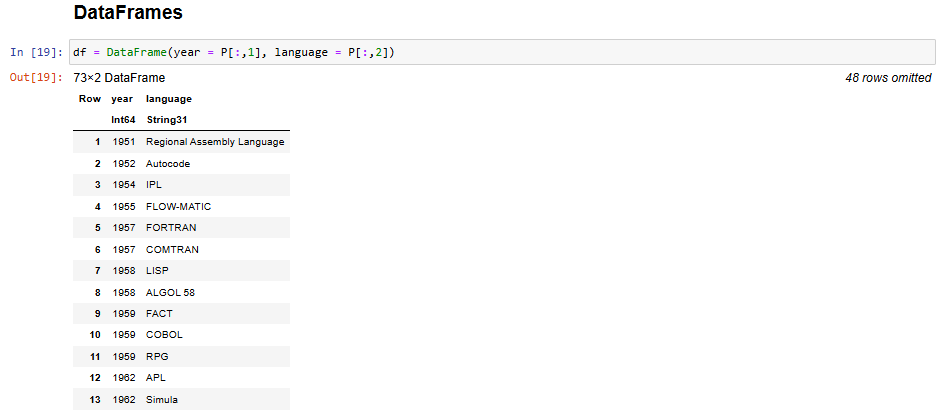{#fig-007 width=65%}

{#fig-008 width=65%}

{#fig-009 width=65%}

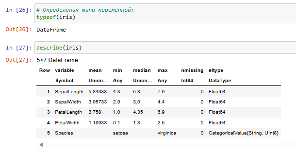{#fig-010 width=65%}

{#fig-011 width=65%}

{#fig-012 width=65%}

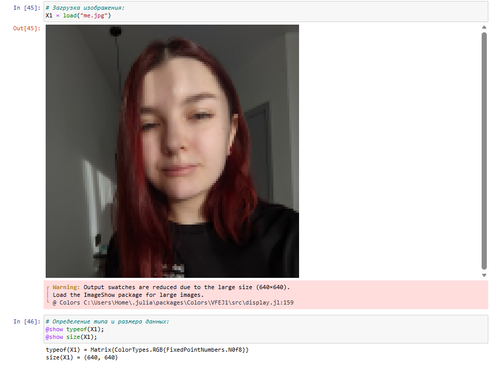{#fig-013 width=65%}

{#fig-014 width=65%}

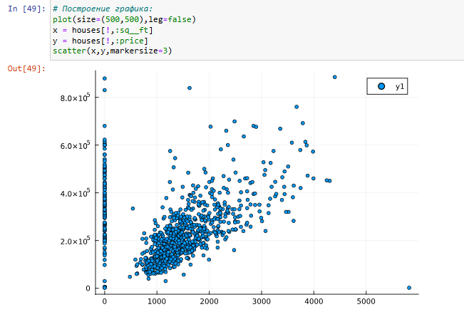{#fig-015 width=65%}

{#fig-016 width=65%}

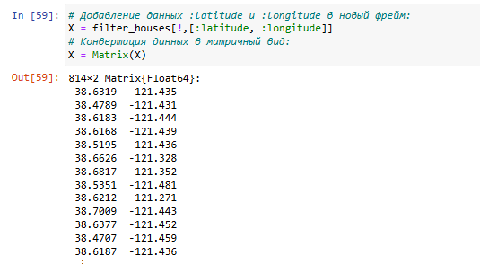{#fig-017 width=65%}

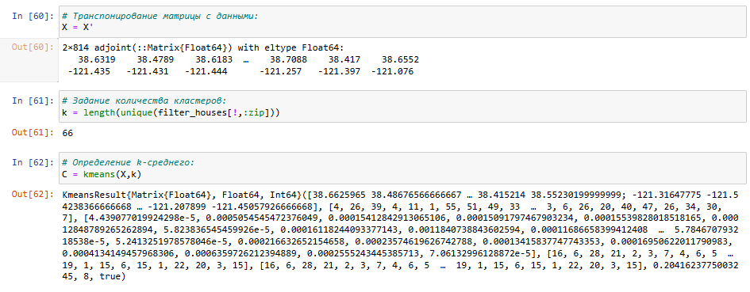{#fig-018 width=65%}

{#fig-019 width=65%}

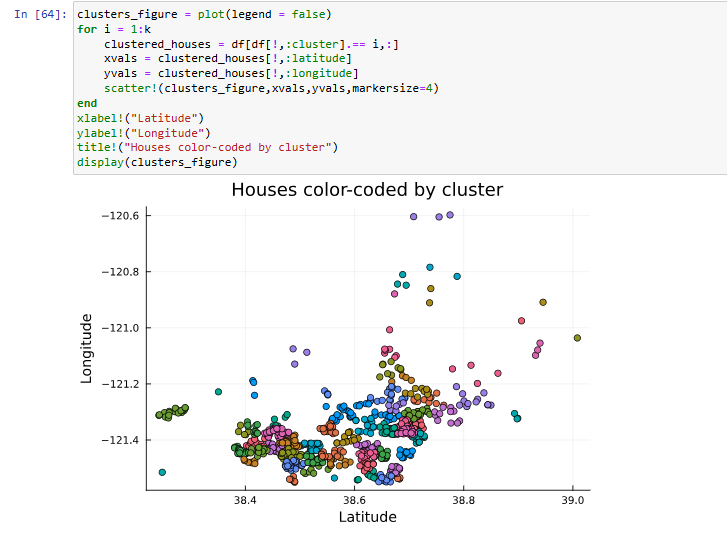{#fig-020 width=65%}

{#fig-021 width=65%}

{#fig-022 width=65%}

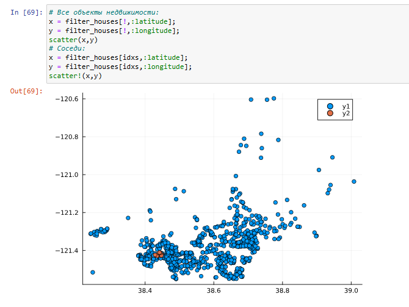{#fig-023 width=65%}

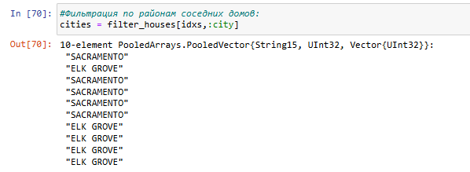{#fig-024 width=65%}

{#fig-025 width=65%}
	
{#fig-026 width=65%}

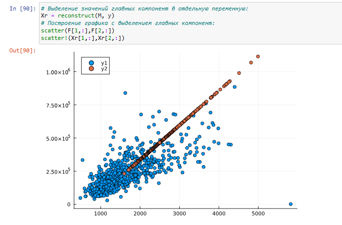{#fig-027 width=65%}

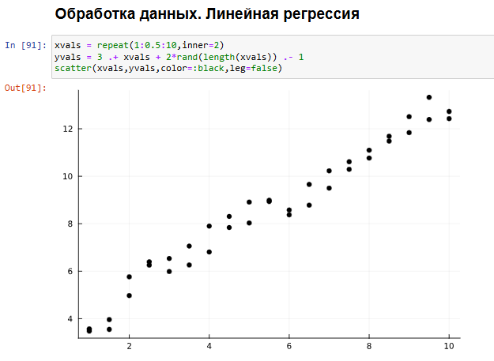{#fig-028 width=65%}

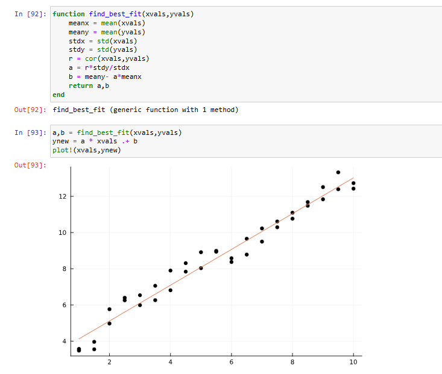{#fig-029 width=65%}

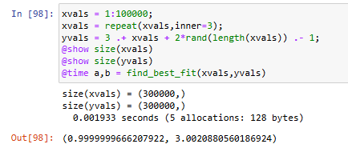{#fig-030 width=65%}

{#fig-031 width=65%}

## Задания для самостоятельного выполнения

1. Загрузите:
```
using RDatasets
iris = dataset("datasets", "iris")
```

Используйте Clustering.jl для кластеризации на основе k-средних. Сделайте точечную диаграмму полученных кластеров. 
Подсказка: вам нужно будет проиндексировать фрейм данных, преобразовать его в массив и транспонировать ([рис. @fig-032], [рис. @fig-033])

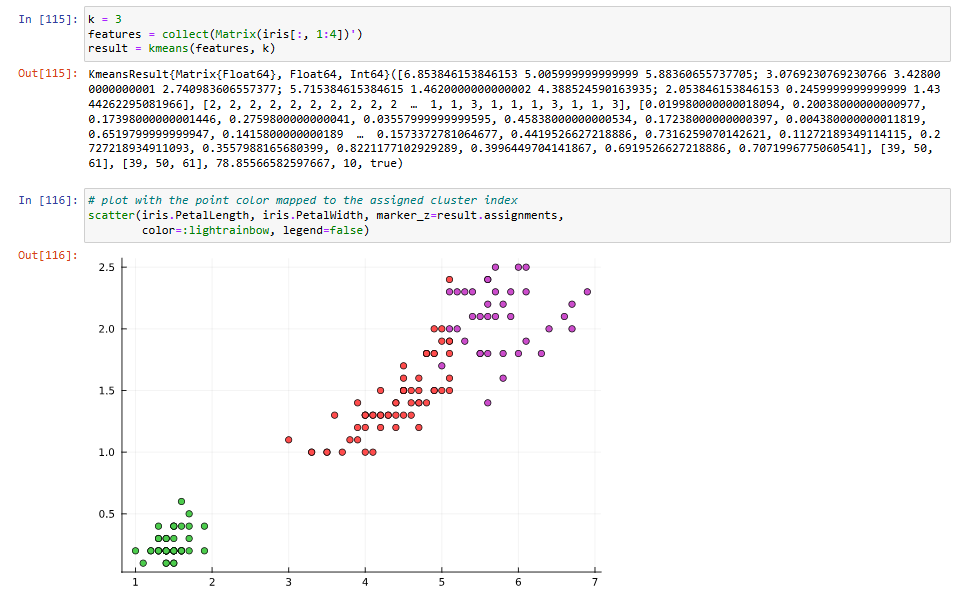{#fig-032 width=65%}

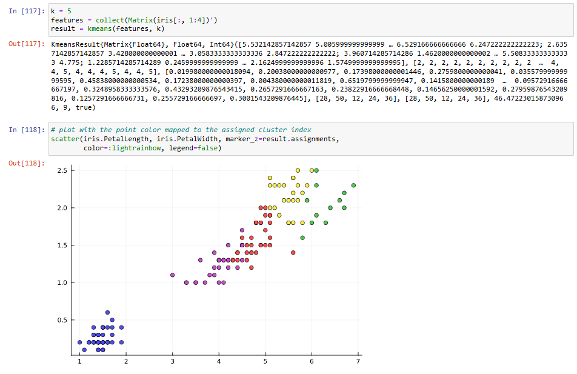{#fig-033 width=65%}

2. Регрессия
- Часть 1. Пусть регрессионная зависимость является линейной. Матрица наблюдений факторов *X* имеет размерность *N* × 3 randn (*N*, 3), массив результатов *N* × 1, регрессионная зависимость является линейной. Найдите МНК-оценку для линейной модели.
	- Сравните свои результаты с результатами использования llsq из MultivariateStats.jl (просмотрите документацию).
	- Сравните свои результаты с результатами использования регулярной регрессии наименьших квадратов из GLM.jl.

Подсказка. Cоздайте матрицу данных X2, которая добавляет столбец единиц в начало матрицы данных, и решите систему линейных уравнений. Объясните с помощью теоретических выкладок ([рис. @fig-034], [рис. @fig-035], [рис. @fig-036], [рис. @fig-037])

{#fig-034 width=65%}

{#fig-035 width=65%}

{#fig-036 width=65%}

{#fig-037 width=65%}

- Часть 2. Найдите линию регрессии, используя данные (*X, y*). Постройте точечный график. Добавьте линию регрессии, используя `abline!`. Добавьте заголовок «График регрессии» и подпишите оси *x* и *y* ([рис. @fig-038], [рис. @fig-039], [рис. @fig-040]).

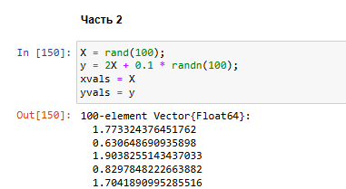{#fig-038 width=65%}

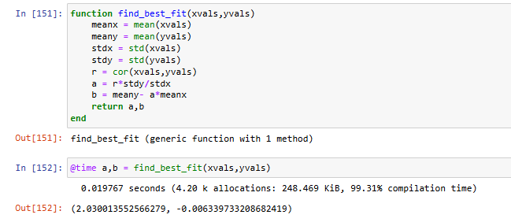{#fig-039 width=65%}

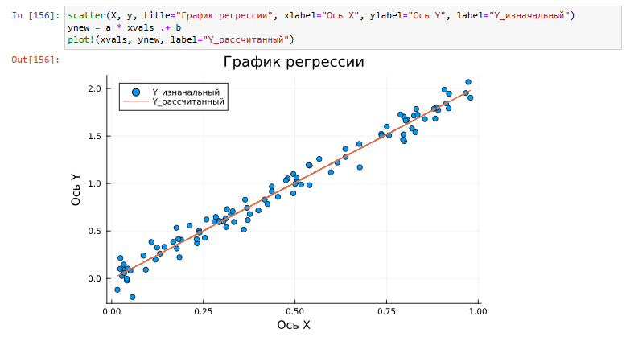{#fig-040 width=65%}

3. Модель ценообразования биномиальных опционов:

Описание модели ценообразования биномиальных опционов можно найти на стр. `https://en.wikipedia.org/wiki/Binomial_options_pricing_model`. Постройте траекторию возможных цен на акции:

- $S$ — начальная цена акции;

- $T$ — длина биномиального дерева в годах;

- $n$ — количество периодов;

- $h = Tn$ — длина одного периода;

- $\sigma$ — волатильность акции;

- $r$ — годовая процентная ставка;

- $u = exp(rh + \sigma \sqrt{h})$;

– $d = exp(rh - \sigma \sqrt{h})$;

– $p* = \frac{exp(rh)-d}{u-d}$.

a) Пусть 𝑆 = 100, 𝑇 = 1, 𝑛 = 10000, 𝜎 = 0.3 и 𝑟 = 0.08. Попробуйте построить траекторию курса акций. Функция rand () генерирует случайное число от 0 до 1. Вы можете использовать функцию построения графика из библиотеки графиков.

b) Создайте функцию createPath (S :: Float64, r :: Float64, sigma :: Float64, T :: Float64, n :: Int64), которая создает траекторию цены акции с учетом начальных параметров. Используйте createPath, чтобы создать 10 разных траекторий и построить их все на одном графике.

c) Распараллельте генерацию траектории. Можете использовать Threads.@threads, pmap и @parallel.

d) Пусть 𝑆 = 100, 𝑇 = 1, 𝑛 = 10000, 𝜎 = 0.3 и 𝑟 = 0.08. Попробуйте построить траекторию курса акций. Функция rand () генерирует случайное число от 0 до 1. Вы можете использовать функцию построения графика из библиотеки графиков ([рис. @fig-040], [рис. @fig-041], [рис. @fig-042], [рис. @fig-043], [рис. @fig-044], [рис. @fig-045], [рис. @fig-046]).

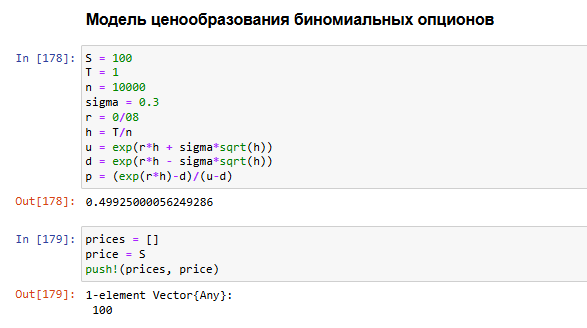{#fig-041 width=65%}

{#fig-042 width=65%}

{#fig-043 width=65%}

{#fig-044 width=65%}

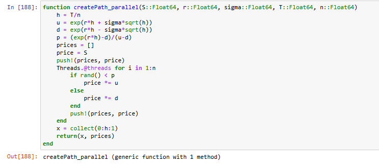{#fig-045 width=65%}

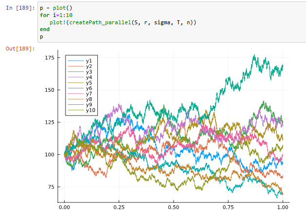{#fig-046 width=65%}

# Выводы

В ходе работы были изучены возможности Julia в использовании специализированных пакетов Julia для обработки данных.

# Список литературы{.unnumbered}

::: {#refs}
:::
